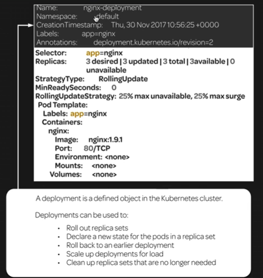
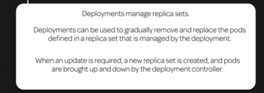
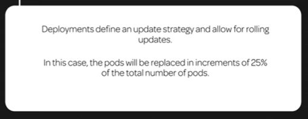
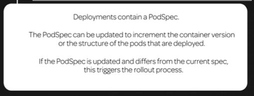
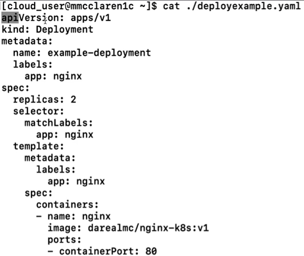

[Back to ACG K8s Quick Start](../main.md)

# Deployments

### Concept) Deployment Example
```
kubectl get deployment
```

* Meta section   
  
* Strategy   
  
* Pod Template
  

#### yaml example

* Commands
  * Create
    ```
    kubectl create -f [yaml_file]
    ```
  * Describe
    ```
    kubectl describe service [service_name]
    ```
  * Update the image
    ```
    kubectl set image [repository] [image_name]:[tag]
    ```

<br>

[Back to ACG K8s Quick Start](../main.md)