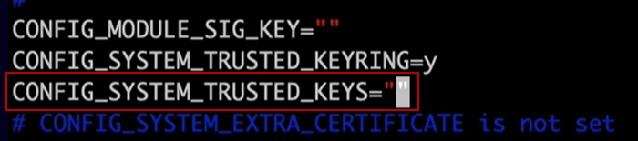
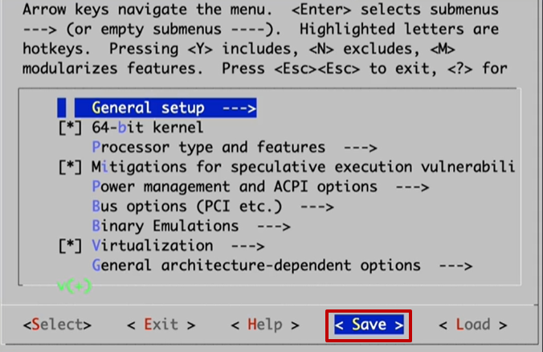

[Back to Linux Overview Main](../main.md)

# Downloading and Extracting the Source Code

<br>

## 1. Downloading and Extracting the Source Code

#### Concept) Kernel Source Code
- Desc.)
  - The kernel code is the SW at the core of the OS.   
  - It is the interface between the HW and the SW components.
  - It has control over everything in the system.
  - It always resides in memory. 

### Hands on)
- Download at [kernel.org](https://www.kernel.org/pub/linux/kernel/)
- Use ```wget``` to download in linux
  ```
  wget https://cdn.kernel.org/pub/linux/kernel/v6.x/linux-6.0.1.tar.xz
  ```
- Use ```tar``` to extract the source code.
  ```
  tar xvf linux-6.0.1.tar.xz
  ```

<br><br>

## 2. Installing the Required Packages

### Concept) Required Packages
|Package Name|Description|
|:-----------|:----------|
|git|A system that tracks source code changes during development and also allows backing out the changes|
|fakeroot|Creates a fake root environment|
|build-essential|Installs build development tools for source code|
|ncurses-dev|Source code development library that provides an API for text-based terminal|
|xz-utils|A utility used for file compression and decompression|
|libssl-dev|Supports SSL and TSL encryption to make connections more secure|
|bc|A programming language that provides basic arithmetic to create equations and perform mathematical options|
|flex|A utility that converts characters into tokens|
|libelf-dev|Shared development library for managing executable files, core dumps, and object code|
|bison|A parser generator that converts input and automatically generates source code|

### Hands on)
```
sudo apt-get install -y git fakeroot build-essential ncurses-dev xz-utils libssl-dev bc flex libelf-dev bison
```

<br><br>

## 3. Configuring and Building the Kernel

### Hands on)
- Change directory into the linux kernel directory
  ```
  cd linux-6.0.1
  ```

- Copy the default configuration file to the top of the newly created directory.
  ```
  cp -v /boot/config-$(uname -r)* .config
  ```

- Open the configuration file for editing, and edit the trusted keys directive.
  ```
  vim .config
  ```
  - Edit as follows.
    ```
    CONFIG_SYSTEM_TRUSTED_KEYS=""
    ```
    - Delete the existing key message and leave it as "".   
      

- Run configuration scripts and open the configuration menu for editing.
  ```
  make menuconfig
  ```
  - Save as the default. (Make no change. Just save!)
    

- Compile the kernel
  ```
  make
  ```
  - Takes very long time

- Install the required modules.
  ```
  make modules_install
  ```

- Install the compiled kernel.
  ```
  make install
  ```


<br>


<br>

[Back to Linux Overview Main](../main.md)