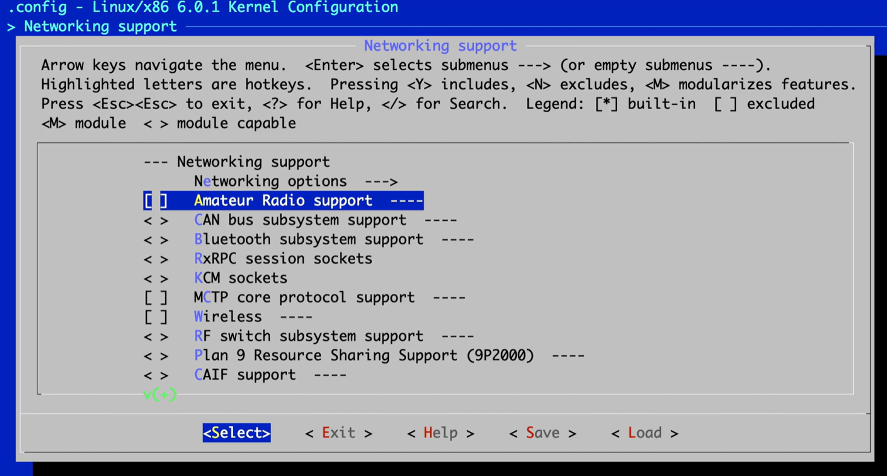

[Back to Linux Overview Main](../main.md)

# 4.2 Optimizing the Kernel for the Cloud

#### Objective)
Make a linux kernel ideal to run in the cloud.

<br>

#### Concept) Cloud
An environment that
- runs DBs and applications
- is accessed over the internet.

<br>

#### Tech.) How to Optimize?
1. Use ```make menuconfig``` command.
   - Target Configurations
      1. Set Code Maturity Levels
         - Why doing this?)
           - To increase the code responsibility
         - How?)
           - Uncheck the prompt for Development and/or Incomplete Code Drivers.
             - These options are needed only when you are developing and testing something in the kernel.
      2. General Setup
         - How?)
           - If you have one processor, uncheck CPU Set Support.
             - Not applicable for multi-core processors
      3. Block Layer
         - How?)
           - If you do not have disk that are larger in size than 2TB, uncheck everything.
      4. Processor Type and Features
         - How?)
           - If you have one processor, uncheck Symmetric Multi-Processing Support.
             - Not applicable for multi-core processors
      5. Kernel Hacking
         - How?)
           - Uncheck everything.
             - why?)
               - You won't be doing kernel development.
      6. Networking
         - How?)
           - Uncheck Amateur Radio Support.
      7. File Systems
         - How?)
           - Verify that everything is marked with an M.
           - If you are not going to use a file system, you can uncheck the corresponding option.
      8. Device Drivers
         - How?)
           - Uncheck or mark Ms for drivers or HW that you do not use.
             - e.g.) SCSI, ISDN
      9.  Bus Options
         - How?)
           - Check your motherboard specs, and disable EISA and MCA support if your motherboard does not use those buses.
   - Hands on)
     - Go to the kernel directory.
       ```
       cd linux-6.0.1
       ```
     - Type the ```make menuconfig``` command.
       ```
       make menuconfig
       ```
       

<br>


<br>

[Back to Linux Overview Main](../main.md)