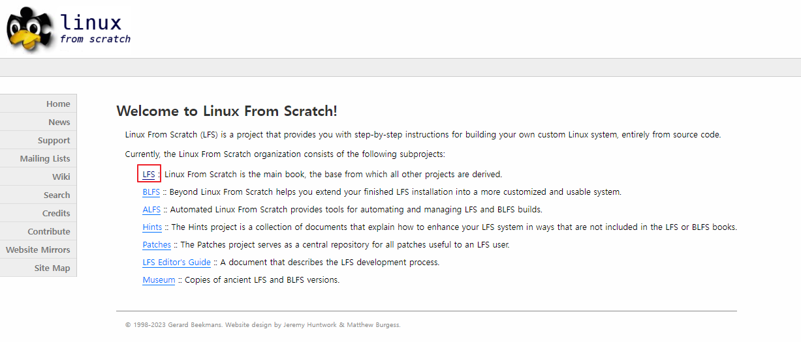
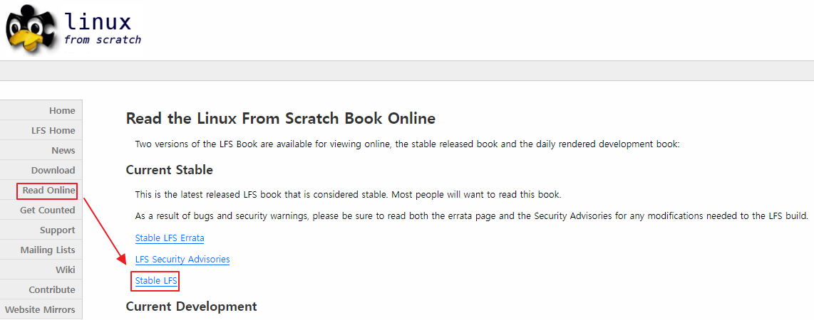

[Back to Linux Overview Main](../main.md)

# Creating a Linux Distribution

 

### Concept) Linux Distribution
An OS, but the kernel is only a piece of SW that is used as an interface for the HW.   
An OS includes users, libraries, runtimes, and a default set of executables.

 

### Review) Building a Kernel
1. Creating the Build Environment
   - Preparing for the Build
   - Setting UP the Virtual Machine
2. Building the Kernel
   1. Downloading and Extracting the Source Code
   2. Installing the required packages
   3. Configuring and building the kernel
   4. Updating the Boot Loader
   5. Verifying the environment

 

### Tech.) Building a Distribution
- Following [www.linuxfromscratch.org](https://www.linuxfromscratch.org).
1. Go to [www.linuxfromscratch.org](https://www.linuxfromscratch.org).   
       
      

 

[Back to Linux Overview Main](../main.md)