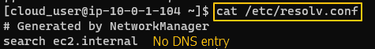
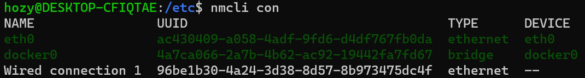
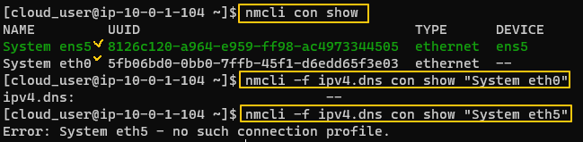
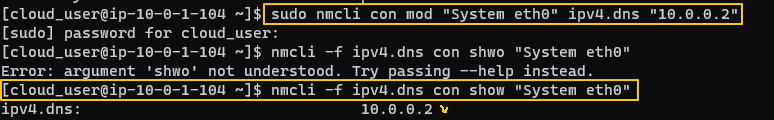

[Back to Linux Main](../main.md)

# Testing DNS Resolution

### Objective
Learn how to configure a system's DNS settings.

<br>

### Hands on
* Verify if the system is capable of communicating with the network.
  ```
  host <url>
  ```
  
  * Not working!

<br>

* Check what DNS server entries you have in /etc/resolv.conf
  ```
  cat /etc/resolv.conf
  ```
  

<br>

#### Tech) Using nmcli
* Review the network connection and the DNS ipv4 settings via nmcli command.
  ```
  nmcli con
  nmcli -f ipv4.dns con show "<connection_name>"
  ```
     
     
  * This system does not have DNS configured for use!
  * cf.) Network-Manager (nmcli)
    * Network manager manages all the network settings of the computer.
    * If the *nmcli* command does not work, install Network Manager.
      ```
      sudo apt-get install -y network-manager
      ```
      - Check if the package is properly working.
        ```
        ncmli general status
        ```

<br>

* Modify the system's default connection to use the network's DNS server. Verify the modification.
  ```
  sudo nmcli con mod "<connection_name>" ipv4.dns "10.0.0.2"
  ncmli -f ipv4.dns con show "<connection_name>"
  ```
  

<br>

* Restart the system's network connection so that the new DNS server can be applied to the DNS servers list at /etc/resolv.conf
  ```
  cat /etc/resolv.conf
  sudo nmcli con up "<connection_name>"
  cat /etc/resolv.conf
  ```

<br>

* Once again, veriry if the system is capable of communicating with the network.
  ```
  host <url>
  ```  


<br>

[Back to Linux Main](../main.md)