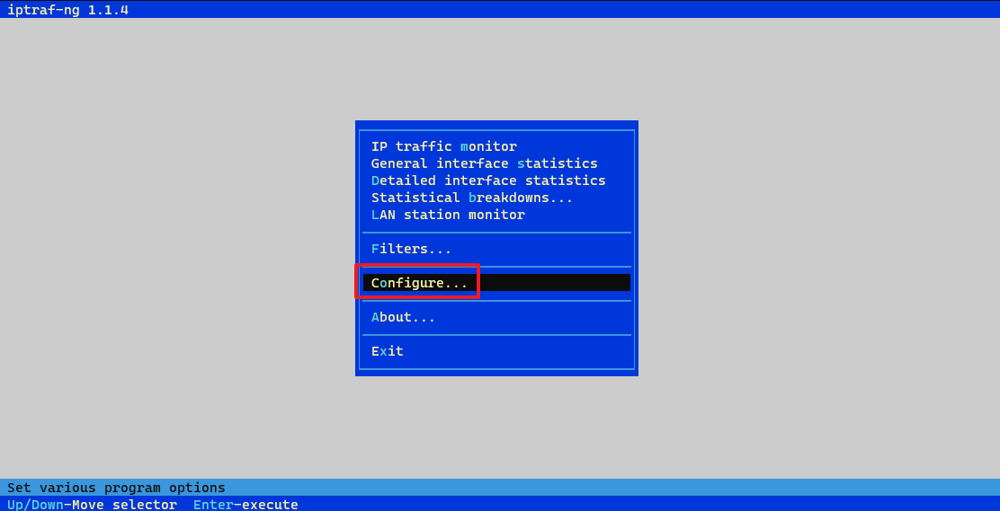
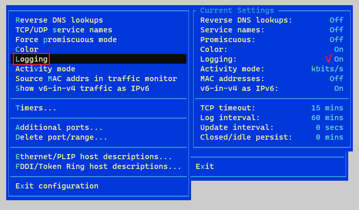
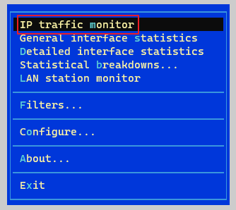
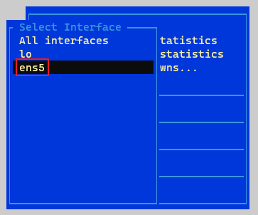
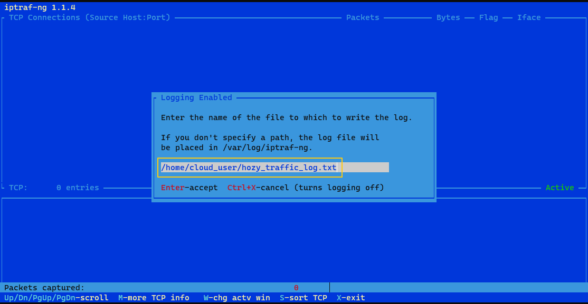
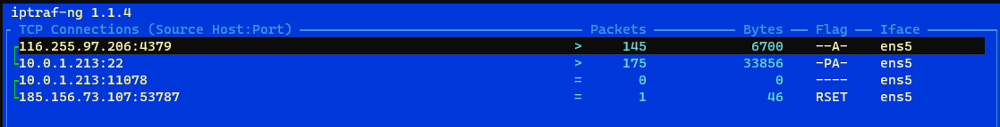
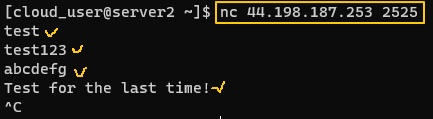
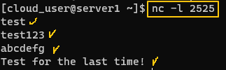
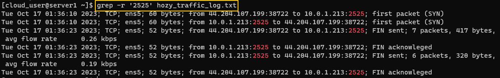

[Back to Linux Main](../main.md)

# Monitoring Network Access

### Objective
Use the netcat (nc) utility to generate network traffic between two servers and view that traffic's appearance in a tool called iptraf-ng.

* Check if the network between two servers are working properly.
  * Use **netcat** to listen for connections in Server 1 over port 2525.
  * Use **netcat** to generate a traffic in Server 2 over port 2525.
  * Use **iptraf-ng** utility to capture all the network traffic to a txt file.

<br>

### Hand-On
* Install utilities for this project on both servers.
  * iptraf-ng, nc, and vim
    ```
    sudo yum install -y iptraf-ng nc vim
    ```

* In Server 1, Let iptraf-ng to start monitoring the traffics.
  ```
  sudo iptraf-ng
  ```
  * Enable logging.   
       
       
  * Choose the target traffic.   
       
       
  * Specify the file that the log will be written.  
        
    * Monitoring started!   
          
    * Do not close this window so that the monitoring can continue.


* Open another command window for Server 1 and use netcat to listen to the port 2525.   
  ```
  nc -l 2525
  ```

* In Server 2, use netcat to generate traffic to Server 1 over the port 2525.   
  ```
  nc <server1_ip_addr> 2525
  <test_string>
  ```   
  * Test scripts typed in Server 2 can be found in Server 1.     
    |Server 2|Server 1|
    |:------:|:------:|
    |||
    * Press **ctrl+c** to get out in Server 2.

* In Server 1, check the log and if there was a traffic in the port 2525.   
  ```
  grep -r '2525' <logfile>
  ```
  

<br>

[Back to Linux Main](../main.md)