[Back to Linux Main](../main.md)

# Network Filesystems

### Objective
Set up both a [Linux Samba](#samba) fileshare and an [NFS](#nfs) fileshare that can then be used by a remote client to store files on.

<br>

### Hands on
#### Samba
|Samba Server|Client|
|-|-|
|Server 1| Server 2|

* In Server 1, make directory and install Samba
  ```
  mkdir /smb
  ```
  ```
  yum install -y samba
  ```

* In Server 1, edit /etc/samba/smb.conf
  ```
  sudo vim /etc/samba/smb.conf
  ```
  * Add the share section
    ```
    [share]
        browsable = yes
        path = /smb
        writable = yes
    ```
    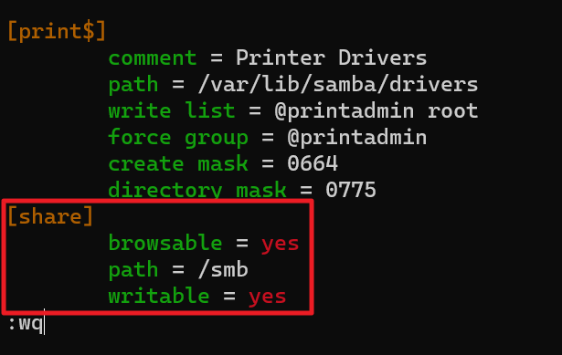
  * Test it.
    ```
    testparm
    ```
    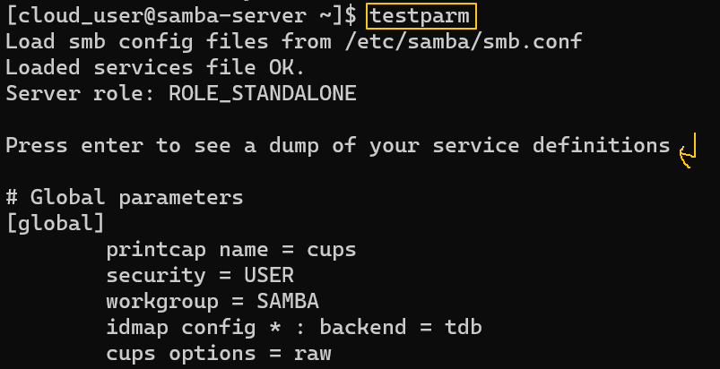

* In Server1, add a user that will share the connection.
  ```
  sudo useradd <user_name>
  ```
  ```
  sudo smbpasswd -a <user_name>
  ```
  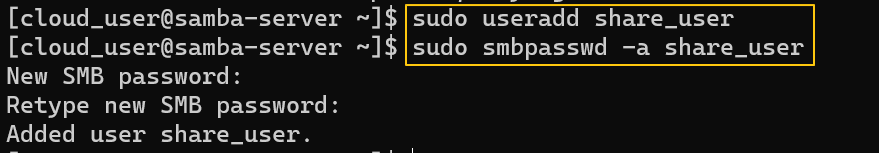

* In Server1, start Samba.
  ```
  sudo systemctl start smb
  ```

* Server 2 will be the client. 
  * Start with the root user
    ```
    sudo su
    ```
  * Install cifs-utlils
    ```
    yum install cifs-utils -y
    ```

* In Server 2, make a directory and mount the Samba server.
  ```
  mkdir /mnt/smb
  ```
  ```
  mount -t cifs //<samba_server_ip>/share /mnt/smb -ousername=<user_name>,password=<password>
  ```
  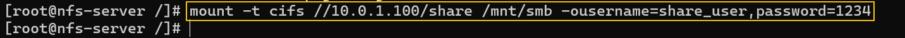
  * How to get ip in the Samba server
    ```
    samba_server$ ip a s
    ```
    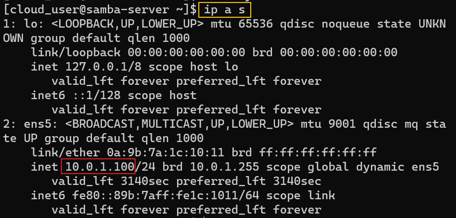

* In Server 1, change the authority of the shared directory.
  ```
  chmod 777 /smb
  ```
  * Modification in Server 2 will not work until, the Samba server's shared directory's authority is changes.

* In Server 2, test the sharing by creating a file.
  ```
  touch /mnt/smb/<file_name>
  ```
  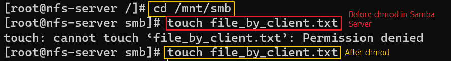
  * Check if the file can be found in Server 1.
    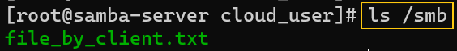


<br>

#### NFS
|Client|NFS Server|
|-|-|
|Server 1| Server 2|

* In Server 2, make the shared directory and install nfs-utils. (sudo user!)
  ```
  mkdir /nfs
  ```
  ```
  yum install -y nfs-utils
  ```

* In Server 2, edit /etc/exports
  ```
  vim /etc/exports
  ```
  * Add the following.
    ```
    /nfs *(rw)
    ```
    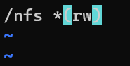

* In Server 2, change the authority for the shared directory.
  ```
  chmod 777 /nfs
  ```

* In Server 2, export the filesystems.
  ```
  exportfs -a
  ```

* In Server 2, start the utilities for the file system network.
  ```
  systemctl start {rpcbind,nfs-server,rpc-statd,nfs-idmapd}
  ```
  * Check if the mount is done successfully.
    ```
    showmount -e localhost
    ```
    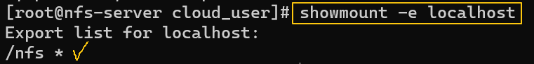
  * Prepare the Server 2's ip address for the Server 1.
    ```
    ip a s
    ```
    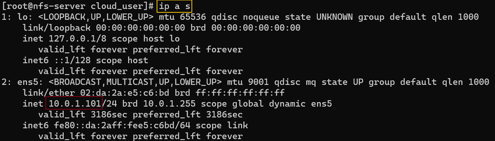

* In Server 1, make the directory and install nfs-utils.
  ```
  mkdir /mnt/nfs
  ```
  ```
  yum install -y nfs-utils
  ```
  * Check the Server 2's mounted directory
    ```
    showmount -e <nfs_server_ip_address>
    ```
    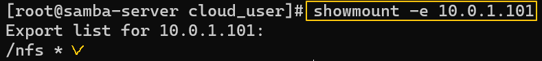

* In Server 1, start the rpcbind and mount the shared directory.
  ```
  systemctl start rpcbind
  ```
  ```
  mount -t nfs <nfs_server_ip_address>:/nfs /mnt/nfs/
  ```

* Test
  * Create a file in Server 1.
    ```
    touch /mnt/nfs/server2_create.txt
    ```
  * Check it in Server 2.
    ```
    ls /nfs
    ```


<br>

[Back to Linux Main](../main.md)