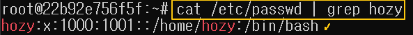
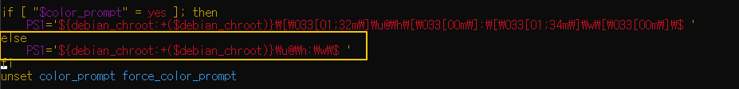
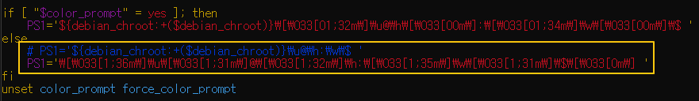

[Back to Linux Main](../main.md)

# Managing Users and Groups in Linux

### Objective
Learn how to manage users and groups.

<br>

### Hands on
Change to root user
```
sudo -i
```

#### 1. Creating Users
* Two types
  1. Using *adduser* command. (**Recommended** : Convenient)
  2. Using *useradd* command. (Inconvenient : Additional Password, home directory, bash, etc. settings required.)

1. Using *adduser* command. 
   ```
   adduser <user_name>
   ```

2. Using *useradd* command.
   * Add a user
     ```
     useradd <user_name>
     ```
   * Set password
     ```
     passwd <user_name>
     ```
   * Create a home dir for the user
     ```
     mkdir -p /home/<user_name>
     ```
   * Give the user the authority to own its home dir
     ```
     chown -R <user_name>:<user_name> /home/<user_name>
     ```

<br><br>

#### 2. Set bash as the default sh.
```
usermod -s /bin/bash <user_name>
```
* Check the result
  ```     
  cat /etc/passwd | grep <user_name>
  ```
  

<br>

* Change bash color prompt.
  * Go to the target user.
    * Must be set for each user, including root.
  * Open ~/.bashrc using a text editor.
    ```
    vim ~/.bashrc
    ```
  * Modify the following part using the text below.
    ```
    PS1='\[\033[1;36m\]\u\[\033[1;31m\]@\[\033[1;32m\]\h:\[\033[1;35m\]\w\[\033[1;31m\]\$\[\033[0m\] '
    ```
       
       
  * Exit and reconnect.
    

<br><br>

#### 3. Change user
* Changing user and moving to its home directory
  ```
  su - <user_name>
  ```
* Changing user at the current directory
  ```
  su <user_name>
  ```

<br><br>


#### 4. Creating and Assigning Groups
* Create a group
  ```
  groupadd <group_name>
  ```

* Assigning groups to users
  * Set a primary group for the user
    ```
    usermod -g <group_name> <user_name>
    ```

  * Set a supplementary group for the user
    ```
    usermod -aG <group_name> <user_name>
    ```
  * Check the result
    ```
    id <user_name>
    ```


<br>

[Back to Linux Main](../main.md)