[Back to Linux Main](../main.md)

# SSH, Redirection, and Permissions in Linux

## Objective
* Enable SSH without a password from dev@server1 to dev@server2
* Copy all the tar files from server1 to server2
* Correctly set the umask so that new files are read/write by their owner only 
* Run the deploy script

  

## Hands on
### 1. Enable SSH without a password from dev@server1 to dev@server2

<table>
<tr align="center">
<td> Server1 </td>
<td> Server2 </td>
</tr>

<tr align="left">
<td>
Generate a ssh-key in sever1  
<code> 
ssh-keygen
</code>  
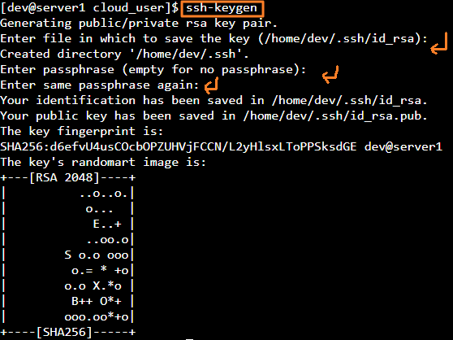
</td>
<td>  </td>
</tr>

<tr align="left">
<td> 

<code> 

</code> 
</td>
<td>  
Get Server2's ip 
<code>hostname -i</code> 
</td>
</tr>

<tr align="left">
<!-- col.1 -->
<td> 
Copy Server2's IP as the ID 
<code>ssh-copy-id [server2_ip] </code> 
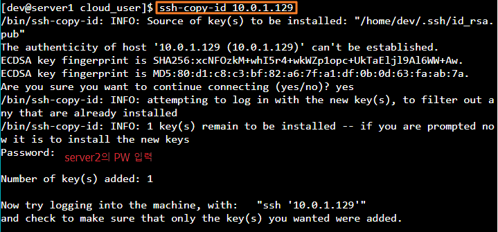
</td>
<!-- col.2 -->
<td>  

</td>
</tr>

<tr align="left">
<!-- col.1 -->
<td> 
Test connection from server1 to sever2 via ssh. 
<code> ssh [server2_ip_address] </code> 
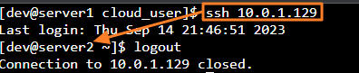
</td>
<!-- col.2 -->
<td>  

</td>
</tr>

</table>  

### 2. Copy all the tar files from server1 to server2

<table>
<tr align="center">
<td> Server1 </td>
<td> Server2 </td>
</tr>

<tr align="left">
<!-- col.1 -->
<td> 
Check the target files in server1. 
<code> ll </code> 
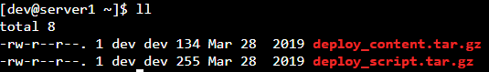  

Send the files to server2. 
<code> scp *.gz [server2_ip_address]:[target_dir] </code> 
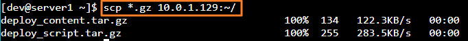  

Connect to server2 directly with ssh and check the files. 
<code>
ssh [server2_user_name]@[server2_ip_address]  
ll
</code> 
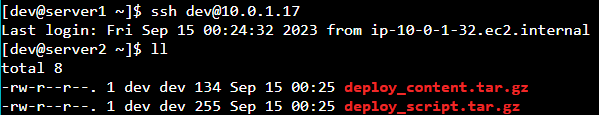
</td>
<!-- col.2 -->
<td>  

</td>
</tr>

</table>  

### 3. Correctly set the umask so that new files are read/write by their owner only.

<table>
<tr align="center">
<td> Server1 </td>
<td> Server2 </td>
</tr>

<tr align="left">
<!-- col.1 -->
<td> 

</td>
<!-- col.2 -->
<td>  
Run the tar files and log them into tar-output.log. 
<code> tar -xvf [target_file] >> [new_log_file] </code> 
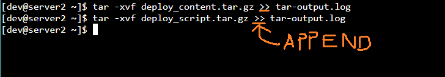  

Check the result. 
<code> ll </code> 
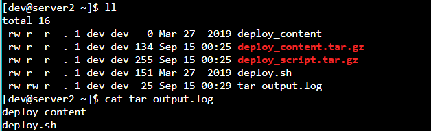  

Check current umask and modify. 
<code> 
umask  
umask 0066  
</code> 
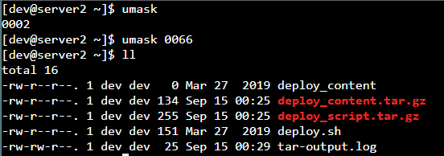  

Modify the authority of the script and check. 
<code> chmod +x deploy.sh   
ll</code> 
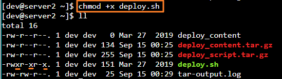  

Run the script. 
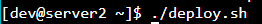

</td>
</tr>

</table>  

 

[Back to Linux Main](../main.md)