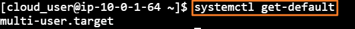
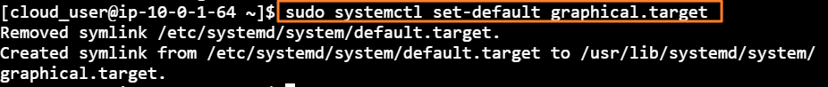
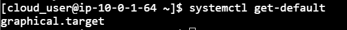

[Back to Linux Main](../main.md)

# Default Boot Target Configuration

### Hands on
#### 1. Determine what the current default target is.
* Verify the current setting
  ```
  systemctl get-default
  ```
  
* Change the target into the graphical environment
  ```
  sudo systemctl set-default graphical.target
  ```
  
* Check one more time.
  ```
  systemctl get-default
  ```
  


<br>


<br>

[Back to Linux Main](../main.md)