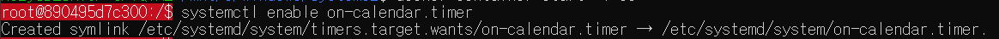

[Back to Linux Main](../main.md)

# Scheduling a Systemd Service Job with Timer Units

### Objective
Run periodic backups of a website directory.

### Reference
* [TWpower's Tech Blog](https://twpower.github.io/213-systemd-timer-example)

### Concepts
* systemd
  * Unifies service configuration and behavior across Linux distributions
* service
  * A unit in systemd that executes a service or a program
  * file type : .service
* timer
  * A unit in systemd that is used for a service that should be run at certain time
  * file type : .timer

<br>

### Hands on
#### Install systemd.
```
sudo apt-get install systemd
```
* Restart required after installation

#### Create the service file.
* File name : on-calendar.service
* Location : /etc/systemd/system/on-calendar.service
* Contents
  ```
  [Unit]
  Description=Test for OnCalendar timer
  
  [Service]
  Type=oneshot
  ExecStart=/usr/bin/test_on_calendar.sh
  
  [Install]
  WantedBy=multi-user.target
  ```
  * Explanation
    * Description : Description for this service
    * Type
      * Options
        * simple : Executed once and terminated. (Activating -> Inactive)
        * oneshot
        * forking
    * ExecStart : The path of the program that will be executed.
    * WantedBy : How will the unit be enabled.

#### Create the log file
```
touch /tmp/OnCalendarLog.txt
```

#### Create the script that will be executed
* File name : test_on_calendar.sh
* Location : /usr/bin/test_on_calendar.sh
* Contents
  ```
  #!/bin/bash

  date >> /tmp/OnCalendarLog.txt
  ```

#### Give authority to execute this script.
```
chmod a+x /usr/bin/test_on_calendar.sh
```

#### Create the timer file
* File name : on-calendar.timer
* Location : /etc/systemd/system/on-calendar.timer
* Contents
  ```
  [Unit]
  Description=Test for OnCalendar timer
  
  [Timer]
  OnCalendar=*-*-* *:*:0/5
  AccuracySec=1s
  
  [Install]
  WantedBy=timers.target
  ```
  * Explanation
    * OnCalendar : Determines the cycle that the service will be executed.
      * Format
        * Default : yyyy-mm-dd hh:mm:ss
        * Repeat every n seconds : \*-\*-\* \*:\*:0/n
    * AccuracySec : Determines the cycle that the timer be run.
      * Default : 1 min
    * WantedBy : How will the unit be enabled.

<br>

#### Enable the timer
```
systemctl enable on-calendar.timer
```


#### Start the timer
```
systemctl restart on-calendar.timer
```

#### Check the timer status
```
systemctl list-timers
```

#### Check the result
```
cat /tmp/OnCalendarLog.txt
```

<br>

[Back to Linux Main](../main.md)