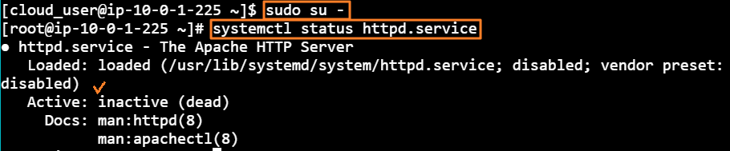
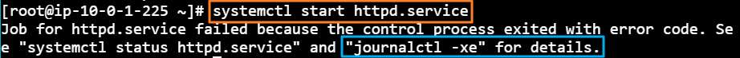
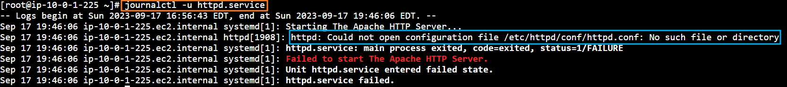
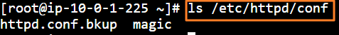
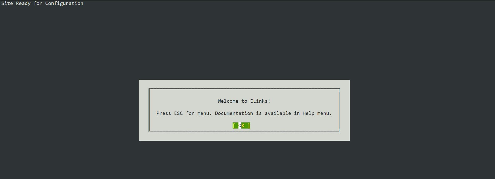

[Back to Linux Main](../main.md)

# System Service Log Files Using the Journal Control

### Situation
* A web server stopped.
* Investigate the failure by looking at the appropriate log file.

<br>

### Hands on
* Change to root account and check the status of the web service.
  ```
  systemctl status httpd.service
  ```
  
* Try restarting, which will fail eventually.
  ```
  systemctl start httpd.service
  ```
  
* Check the journal as guided above
  ```
  journalctl -u httpd.service
  ```
  
  * Check /etc/httpd/conf/httpd.conf
    ```
    ls /etc/httpd/conf
    ```
    
  * Restore httpd.conf using the backup
    ```
    mv /etc/httpd/conf/httpd.conf.bkup /etc/httpd/conf/httpd.conf
    ```
  * Restart the service
    ```
    systemctl restart httpd.service
    ```
    ```
    systemctl start httpd.service
    ```
* Browse to a local webpage using elinks
  ```
  elinks http://localhost
  ```
  


<br>

[Back to Linux Main](../main.md)