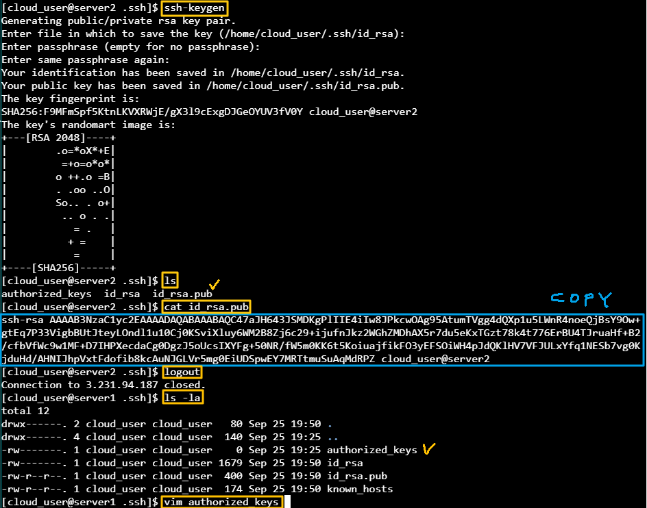

[Back to Linux Main](../main.md)

# SSH Keys for Secure Access

### Objective
* Situation
  * Needs file exchange between two severs
  * In this example, both servers will have CentOS 7
    
    
    
* Goal
  * Allow access from server1 to server2 and vice versa without password!
* How?
  * Create ssh public keys in both servers.
  * Append each other's key into .ssh/authorized_keys file


<br>

### Hands on

1. Both in server1 and server2
   * Install ssh
     ```
     sudo apt-get install ssh
     ```
   * Generate keys
     ```
     ssh-keygen
     ```
   * Create .ssh/authorized_keys
     ```
     touch 
     ```
   * Copy .ssh/id_rsa.pub and paste it into the counterpart's .ssh/authorized_keys
     ```
     cat .ssh/id_rsa.pub 
     ```
     ```
     vim .ssh/authorized_keys
     ```
     

2. Connect
* Check target server's hostname
  ```
  hostname -i
  ```

* Connect to target server directly.
  ```
  ssh [target_user_name]@[target_server_host]
  ```

<br>

[Back to Linux Main](../main.md)