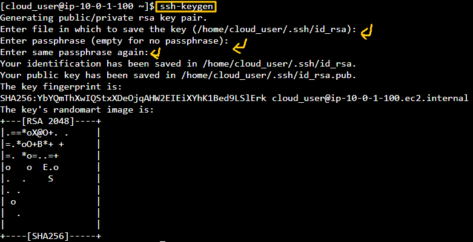
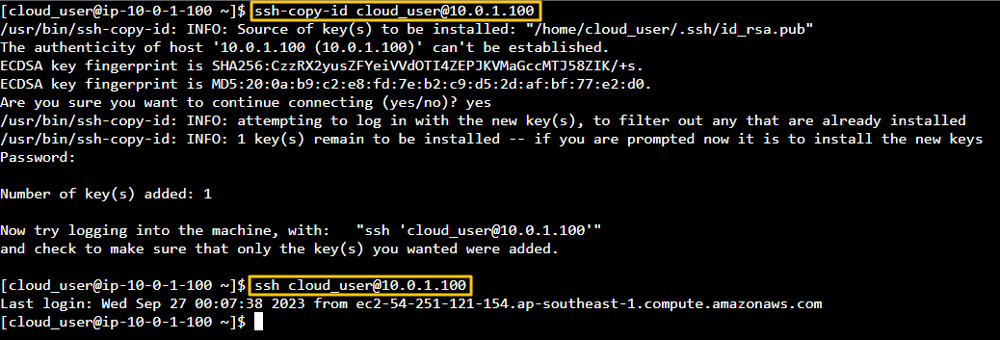
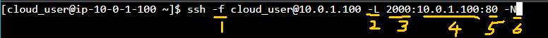
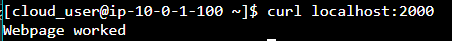

[Back to Linux Main](../main.md)

# SSH Tunnel for Network Traffic

### Objective
* Port forwarding via SSH (SSH tunneling) creates a secure connection between your server and a remote machine through which any number of services can be relayed. 
    * you can pass traffic that uses an unencrypted protocol (e.g., IMAP, VNC) over an encrypted network stream to increase security.

* Our Security team is locking down our access, so let's get things done right. Our security team has dictated that all traffic leaving Datacenter 2 (where the CentOS 7 CLIENT is installed) must be encrypted.

* Since yum makes http calls that means that it can't run updates or install new packages with the current setup.

* Your SSH Tunnel SERVER is running a web server on port 80. 
* Once the tunnel is set up another team will set the SERVER up as a yum repository. 
* You've been tasked with setting up an SSH tunnel so that traffic can be encrypted from the CLIENT to the SERVER which will allow the CLIENT to install new packages. 
* You should additionally create an SSH key so that a password isn't required to connect from the CLIENT to the SERVER as the user cloud_user.

 

### Hands on
* *ssh-keygen* in CentOS 7 Client.   
  
* *ssh-copy-id* using private ip address of CentOS 7 Client. After that, test ssh.
  
* Create ssh tunnel.   
  
  |No.|Cmd|Meaning|
  |:-:|:--|:------|
  |1|-f|Run the process at the background.|
  |2|-L|Create a tunnel|
  |3|2000|Local port|
  |4|10.0.1.100|Host address|
  |5|80|Remote port|
  |6|-N|Not dealing with other systems?|
* Check if the tunnel is properly working.   
  
  * cf.)
    * By doing curl, you are hitting the local port and it's forwarded by the tunnel to the host.
  

 

[Back to Linux Main](../main.md)