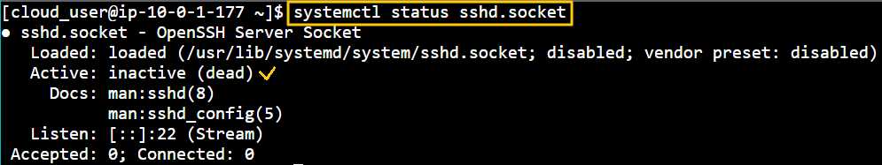
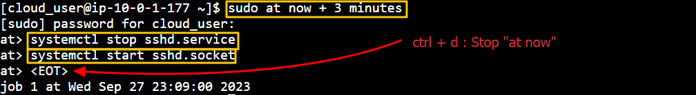
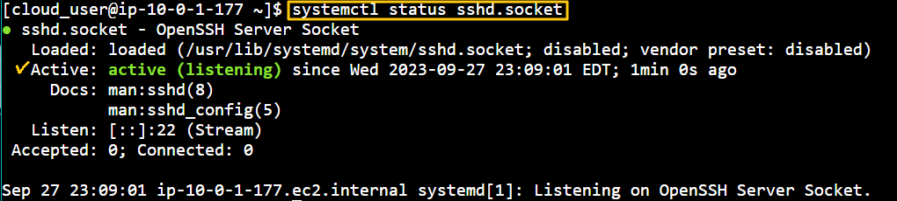
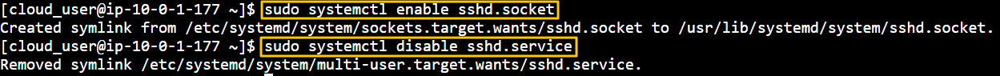
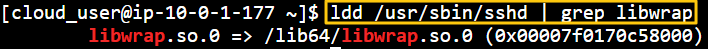
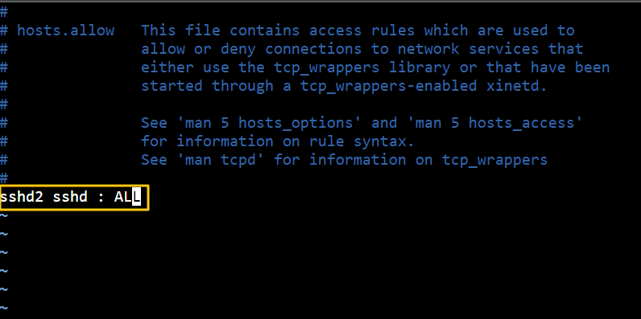
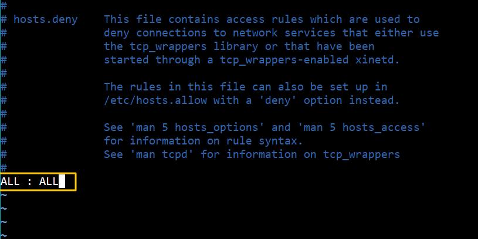
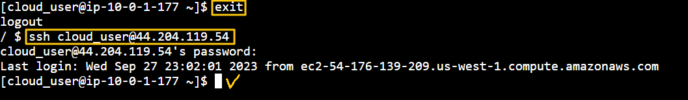

[Back to Linux Main](../main.md)

# TCP Wrappers and Systemd Sockets

### Objective
* A Linux system administrator is responsible for keeping their servers secure. 
* There are a multitude of tools and software packages available to keep a networked Linux system safe from malicious intruders. 
* Learn how to use systemd socket units. 
  - Socket units only provide access to a network service when an incoming connection requests it. 
  - To further enchance the security of the service, we will apply TCP wrappers to allow incoming connections to a specified service.

<br>

### Hands on
- Verify that the *sshd.socket* unit is not working
  ```
  systemctl status sshd.socket
  ```
  

- Run "at now" command
  ```
  sudo at now + 3 minutes
  ```
  - Why doing this?)
    - To stop *sshd.service* and start *sshd.socket*
  - Stop *sshd.service* and start *sshd.socket*
    ```
    systemctl stop sshd.service
    ```
    ```
    systemctl start sshd.socket
    ```
    - Press **ctrl + d** to stop "at now."   
  - 
- Check if the *sshd.socket* is active now.
  ```
  systemctl status sshd.socket
  ```
  
- Enable sshd.socket and disable sshd.service
  - why doing this?)
	- Make the switch over from sshd.service to sshd.socket PERMANENT.   
	  
- Set up TCP Wrapper for the additional security
  - Check if the ssh server is compiled to use TCP Wrapper.   
    
  - Permit any incoming ssh connection through network.
    - Edit /etc/hosts.allow.   
          
         
  - Set the default deny rule for TCP Wrapper to deny any other incoming connections.   
        
     

- Exit from the server. And try connecting to it via ssh.   
   

<br>

[Back to Linux Main](../main.md)