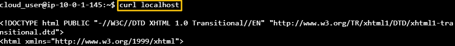
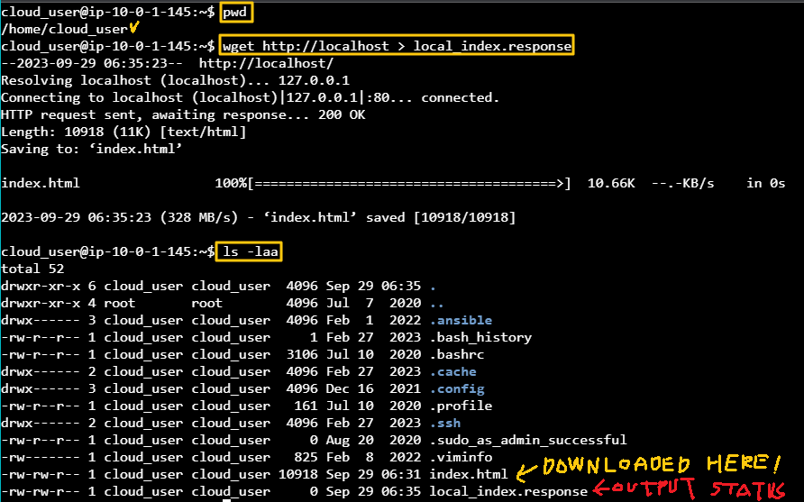
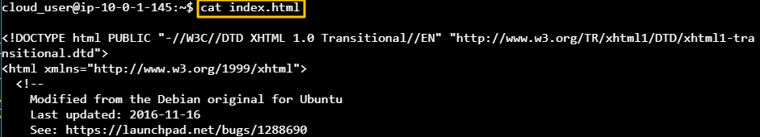
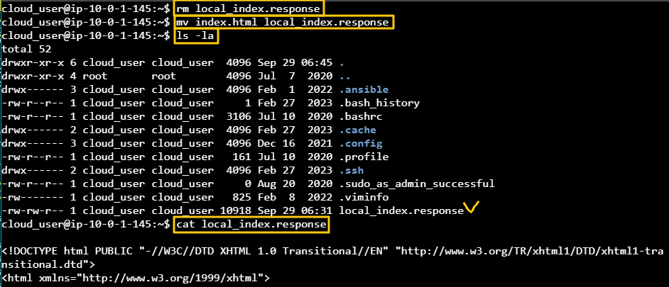

[Back to Linux Main](../main.md)

# [Debian/Ubuntu] Package Installation and Management

### Objective
- Provision the web server to show basic web pages in Ubuntu Systems
- To do that you should install the Apache2 Web Server System

<br>

### Hands on
* Update apt.
  ```
  sudo apt update
  ```

* Install apache2 and wget
  ```
  sudo apt-get install apache2 wget
  ```

* Check the local host.
  ```
  curl localhost
  ```
  

* Capture the localhost's image to ~/local_index.response
  ```
  cd ~
  ```
  ```
  wget http://localhost > local_index.response
  ```
  
  - wget downloaded index.html and output the status to local_index.response
    - Since the download was successful, nothing was recorded in local_index.response
    

<br>

Our objective is to download the localhost page to the local_index.response file.
- So, remove the existing local_index.response and change index.html's name into local_index.response.
  

<br>

[Back to Linux Main](../main.md)