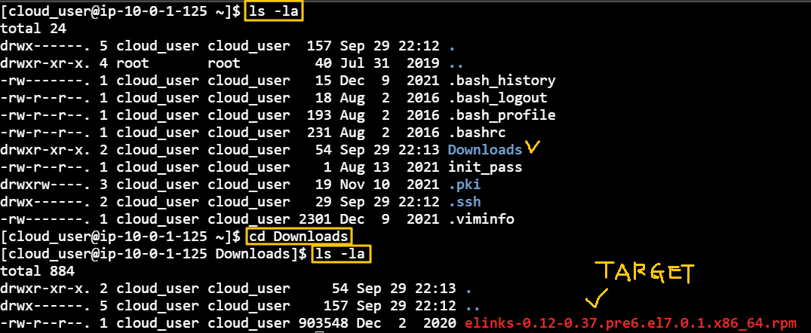
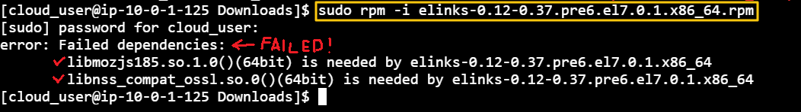
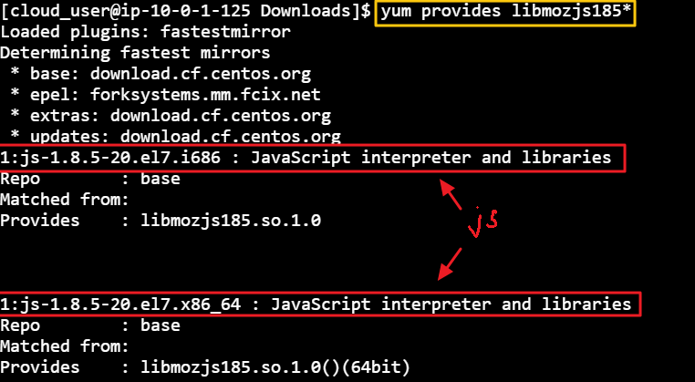
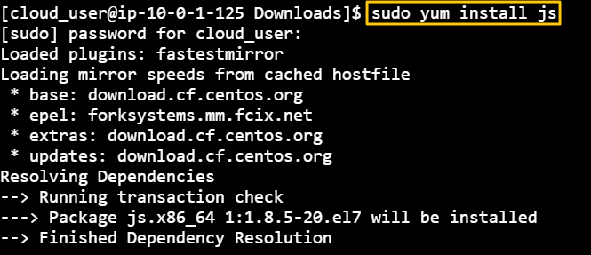
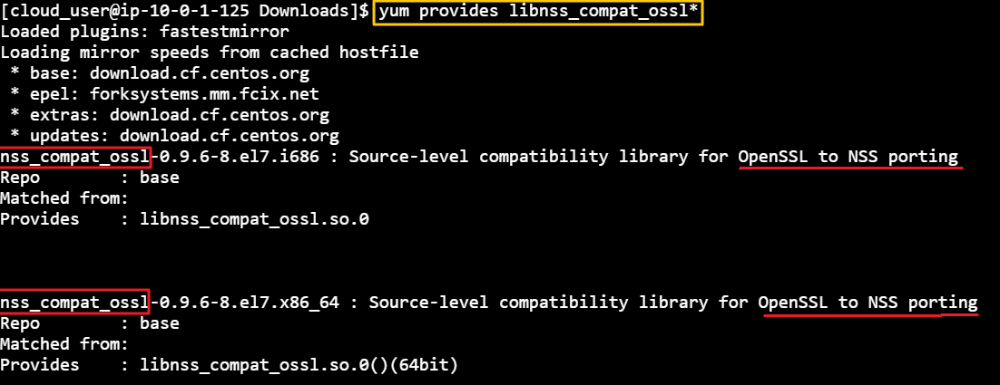
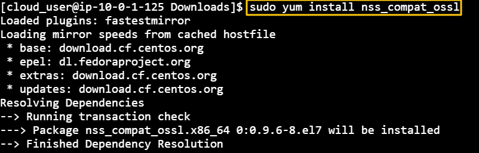

[Back to Linux Main](../main.md)

# [Red Hat/CentOS] Package Installation and Management

### Objective
- Install Available Elinks Application
- Verify Elinks Package RPM Exists

 

### Hands on
Situation
- Developers are having a trouble with installing elinks

 

Solution
- Figure out what is the problem with the elinks installation   
  
- Try installing elinks using rpm   
  
  - Failed due to the following two dependency.
    - libmozjs185. ~~~
    - libnss_compat_ossl. ~~~
  - Let's deal with them using yum.
- Check what yum can provide with libmozjs185*   
  
  - It says that js is required. So let's install js.   
    
  - Let's try installing elinks once again if the dependency is fixed.   
    
    - Still, libnss_compat_ossl is the problem. Check with yum once again

- Check what yum can provide with libnss_compat_ossl   
  
  - nss_compat_ossl is needed. Let's install it with yum.   
    
- Try installing elinks with rpm again. And check if it works properly.   
  

 

[Back to Linux Main](../main.md)