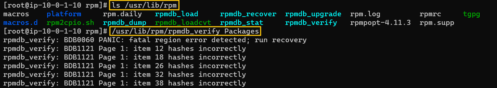
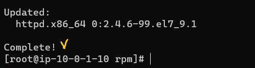

[Back to Linux Main](../main.md)

# RPM Troubleshooting

## Objective
- Install telnet and install Apache.

<br>

## Hands on
### 1. Troubleshoot Installing Telnet
Tried to yum install telnet, but not working.

- The error says, it could not open Packages database in */var/lib/rpm*

<br>

Let's trouble shoot rpm.
- Connect with the root user.
  ```
  sudo -i
  ```
- Go to the directory */var/lib/rpm* and check packages.
  ```
  cd /var/lib/rpm
  ```
- Run rpmdb_verify file that is located at */usr/lib/rpm/rpmdb_verify*   
     
     
  - It says that the current "Packages" cannot be verified.
- Make a backup for the current "Packages"
  
- Run *rpmdb_dump* with the current Packages.bad and pipe it to *rpmdb_load*
  ```
  /usr/lib/rpm/rpmdb_dump Packages.bad | /usr/rpm/rpmdb_load Packages
  ```
  
- Redo verification with the new Packages.
  ```
  /usr/lib/rpm/rpmdb_verify Packages
  ```
  
- Rebuild the database.
  ```
  rpm -vv --rebuilddb
  ```

<br>

Try *yum install telnet* again
   
   

- Successful!

---

<br><br>

### 2. Troubleshoot Installing Apache

Let's install Apache which is httpd.

- The message says that this repository is search disabled.

<br>

Let's check if there is a httpd related configuration in yum

- There was a excluding config in *yum.conf*. Let's disable this.
  ```
  vim yum.conf
  ```
  

<br>

Check if the disabling and retry installing Apache
   



<br>

[Back to Linux Main](../main.md)