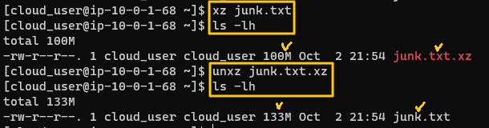

[Back to Linux Main](../main.md)

# Compressed Files in Linux

### Objective
Dealing with various compressed files in Linux
- Compresssion Algorithms
    - gzip
    - bzip2
    - xz    
- Utilities
  - tarball
      - It uses existing compression algorithms such as gzip, bzip2, xz, etc.        
  - zcat
      - It allows reading compressed files without decompressing them.
          - gzip : zcat
          - bzip2 : bzcat
          - xz : xzcat

<br>

### Hands on
Check the original file, which is huge in size.


There are three ways to compress and decompress.
- [Compressed Files in Linux](#compressed-files-in-linux)
    - [Objective](#objective)
    - [Hands on](#hands-on)
      - [1. Compress and decompress directly using the compression algorithms.](#1-compress-and-decompress-directly-using-the-compression-algorithms)
      - [2. Using tarball, compress and decompress files.](#2-using-tarball-compress-and-decompress-files)
      - [3. Using zcat, read a compressed file without decompressing it.](#3-using-zcat-read-a-compressed-file-without-decompressing-it)


#### 1. Compress and decompress directly using the compression algorithms.
1. gzip
   - Compress   
     ```
     gzip [file_name]
     ```
     
   - Decompress      
     ```
     gunzip [file_name]
     ```
     
2. bzip2
   - Compress   
     ```
     bzip2 [file_name]
     ```
     
   - Decompress      
     ```
     bunzip2 [file_name]
     ```
     
3. xz
   - Compress   
     ```
     xz [file_name]
     ```
   - Decompress      
     ```
     unxz [file_name]
     ```
     

<br>

#### 2. Using tarball, compress and decompress files.
- tarball compression options
  
- Trial
  - gzip
    
  - bzip2
    
  - xz
    

<br>

#### 3. Using zcat, read a compressed file without decompressing it.
- Trial
  - Compress a file using tarball into gzip.   
    
  - Read it with zcat.   
    


<br>

[Back to Linux Main](../main.md)