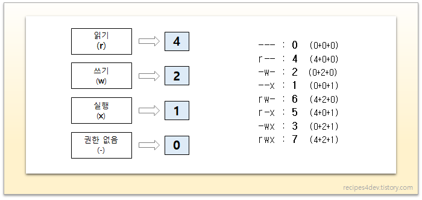

[Back to Linux Main](../main.md)

# 6.3 File Attributes and Permissions

## Concept) chmod
- Def.)
  - Change the permission for the user, the group, and every user to read, write, and execute a file or a directory

### Syntax 1)
```
chmod [target_user][add_or_delete][target_activity] [file_name/directory_address]
```
#### Modes
  1. target_user
      - u : the owner
      - g : the owner group
      - o : every other users
      - a : all users
  2. add_or_delete
      - \+ : Add
      - \- : Delete
      - \= : Remain in current authority
  3. target_activity
      - Files
          - r : Read the file
          - w : Write on the file
          - x : Execute the file
      - Directories
          - r : Read files and dirs in the target directory
          - w : Allow to add, modify names, or delete files and directories in the target directory
          - x : Allow access to the target directory
          ```
          cd [target_dir]
          ```
#### e.g.)
  - Allow the current user to write on *file.txt* file.
      ```
      chmod u+w file.txt
      ```
  - Block the owner group from accessing the *here* directory
      ```
      chmod g-x here
      ```

<br>

### Syntax 2)
Denote the authorities using the binary numbers.   
    
* e.g.)
  * Allow every user and group to read, write, and execute *file.txt*
    ```
    chmod 777 file.txt
    ```
  


<br>

[Back to Linux Main](../main.md)