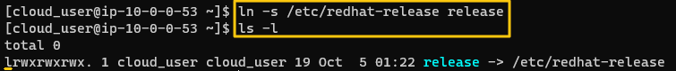
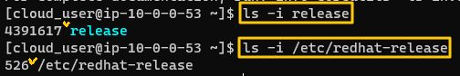
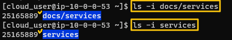
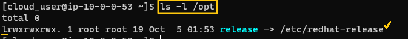
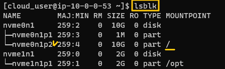
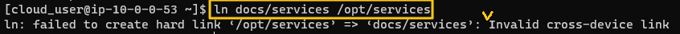

[Back to Linux Main](../main.md)

# Hardlink vs Softlink (Symbolic Link)

- Types of Links
    - Softlink (symbolic link)
        - A new file that references an existing file				
    - Hardlink
        - A link between two identical files located at different directory


<br>

## How to Create Links
### 1. Softlink
* Command
  ```
  ln -s <target> <link_name>
  ```
  
  - A softlink file's permission starts with "*l*."
- cf.) How do we know that symbolic link is a distinct file?
  - Compare the inode numbers of the files (Red Hat)
    

### 2. Hardlink
* Command
  ```
  ln <file1> <file2>
  ```
- cf.) Hardlink is not a distinct link file like the softlink.
  
  - Check that the hardlink file's permission does not start with "*l*."
- cf.) The original and the copy are sharing the same inode number.
  


<br><br>

## Experiments) Links Across File Systems
Can we make links across different file systems?
- Answer
  - Softlink : Yes
    - why?) 
      - Symbolic link is just a link file that points back at certain file.
  - Hardlink : No
    - why?) 
      - Hard Link makes two files share the same inode number
      - However, an inode number in one file system does not exist in the other file system.


#### Experiment 1) Softlink
Create a symbolic link for the "/etc/redhat-release" at "/opt" with name "release".   
   
   

<br>

#### Experiment 2) Hardlink
Check the individual block devices.   
   
- The home directory is at nvme0n1p2
- Let's try to create a hardlink between "docs/services" and "/opt/services" which are located in different file systems.

<br>

Try to create a hardlink between "docs/services" and "/opt/services" : Across the file systems.   



<br>

[Back to Linux Main](../main.md)