[Back to Linux Main](../main.md)

# GPG for File Encryption

### Concept) GNU Priavacy Guard (GPG)
- We can employ the GNU Privacy Guard, or GPG, toolset to encrypt files; and through the use of sharing public keys with other users, we can decrypt files from other people.
		
### Objective
- Create a new GPG key
- Encrypt a file and sign it
- Send that file to another user to decrypt with our public key

<br>

### Hands on
- Create a GPG key
  ```
  gpg --gen-key
  ```
  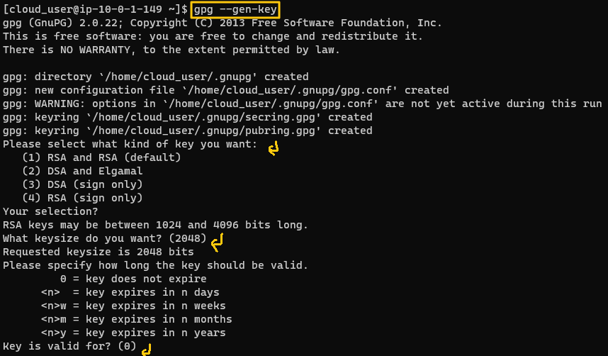   
  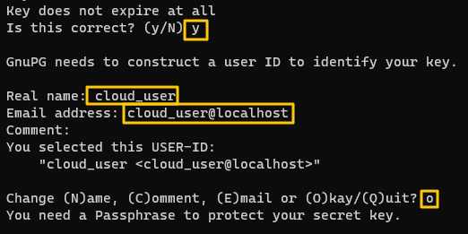   
  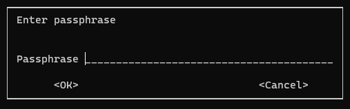   
  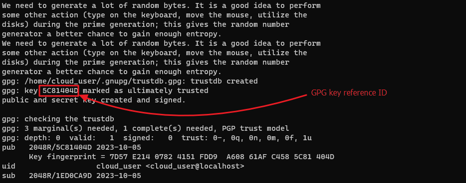   

<br>

- Export the key file that a user can decrypt file from the system.
  - Target User : gfreeman   
    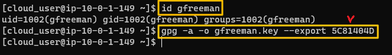   
  - Mail the key to gfreeman   
    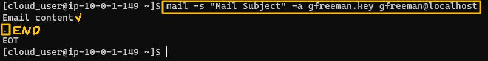   
    - Enter period at the end of the mail content.

<br>

- Receiving the GPG key from the other user
  - Log in with the gfreeman account
    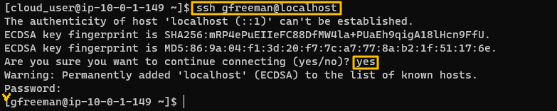    
  - Generate a GPG key for gfreeman as well.
    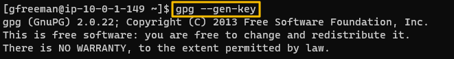   
    ...   
    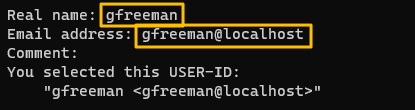   
    ...   
    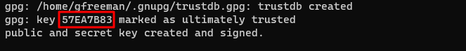   

<br>

- Download the key sent by cloud_user via email, using the mutt program.
  ```
  mutt
  ```
  - Mutt main screen.   
    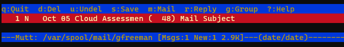   
  - Press Enter to see the email.     
    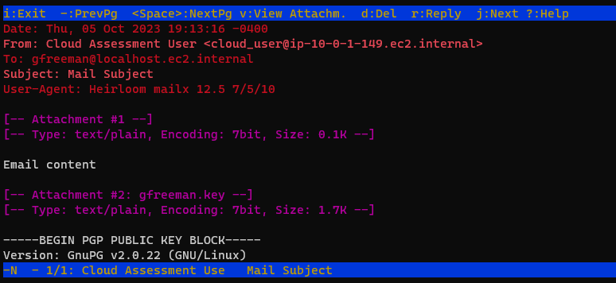   
  - Press *v* to view the attachment.     
    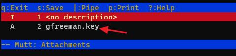   
  - Move cursor to the gfreeman.key file and press enter.     
    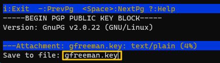   
  - Press *s* to save the file at the main directory.     
    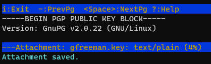   
  - Press *q* to exit.     
- Check the downloaded GPG key.   
  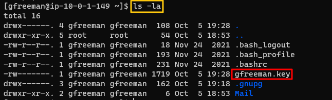
- Import the public key from the user account into gfreeman's key rink.   
  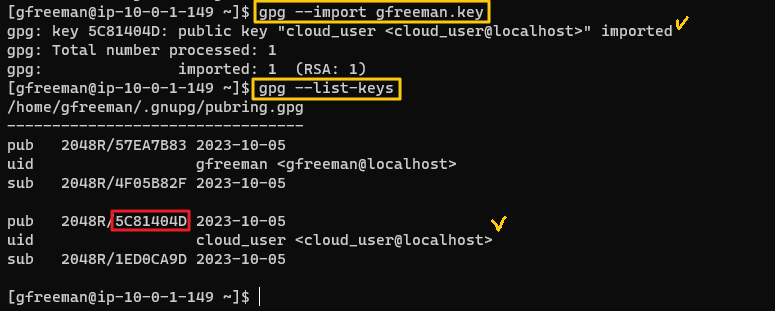   


<br>

Let's simulate the GPG key verification.   
If a user creates a file and send it to another user, the other user can verify the creator using the GPG key

- Create a file with cloud_user account and sign it with cloud_user's private key.   
  ```
  gpg --clearsign [file_name]
  ```
  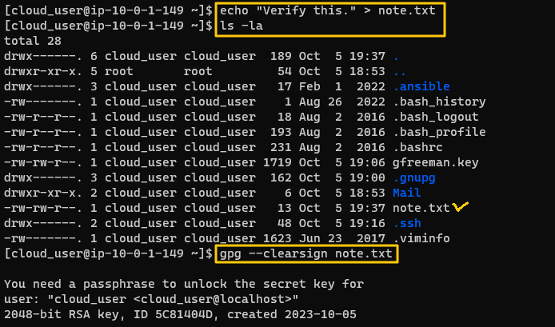   
  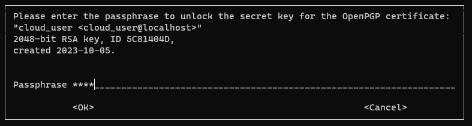   
- asc file has been created.   
  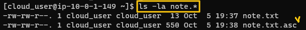
- Send the note.txt.asc to gfreeman via email.   
  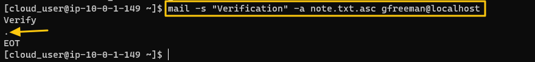
- Login to gfreeman account and download the attached asc file from the email using mutt.   
  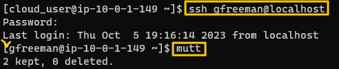   
  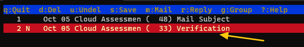   
  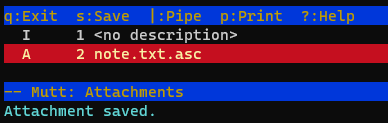   
  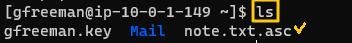   
- Verify the note.txt.asc file.
  ```
  gpg --verify [asc_file_name]
  ```
  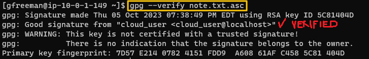


<br>

Try GPG encryption.
- Copy /etc/fstab ~ and encrypt it.   
  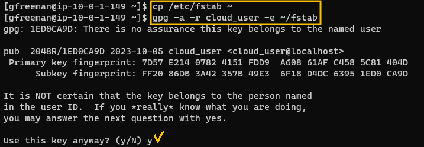   
  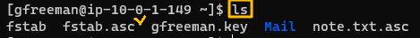   
- Send email back to cloud_user attaching the created asc file.    
  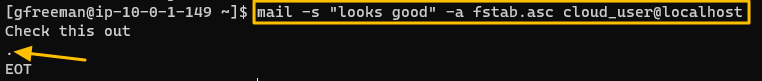
- Download the attached file in the cloud_user.   
  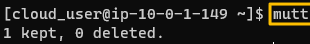   
  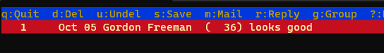   
  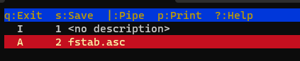   
  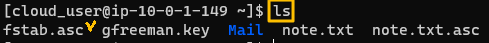   
- Decrypt the file using the GPG key and READ it.   
  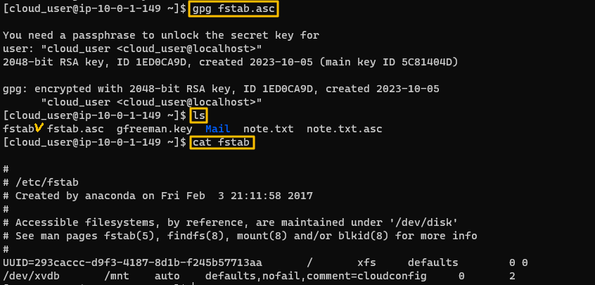


<br>

[Back to Linux Main](../main.md)