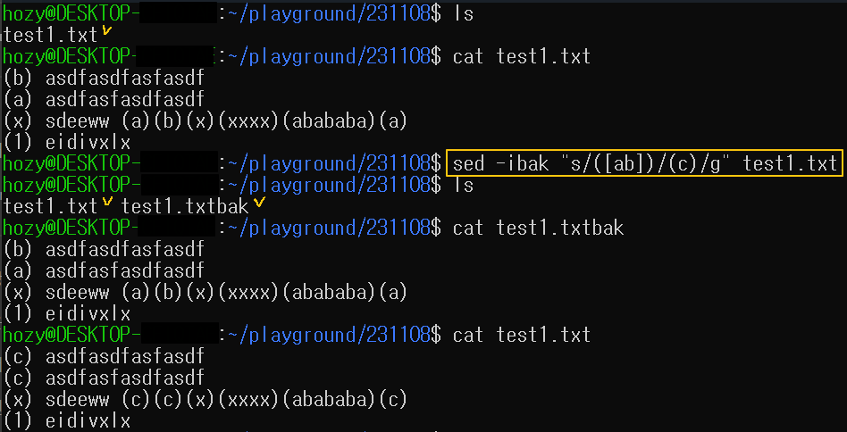

[Back to Linux Main](../main.md)

# sed : Text File Modification (Replace)

### How to sed
* Basic Syntax
  ```
  sed "[sed_command]" [target_file]
  ```

#### 1. Use the extended regular expression
```
sed -E "[extended_regex]" [target_file]
```

#### 2. Substitution
```
sed "s/[from_string]/[to_string]/" [target_file]
```
- Above command substitutes the first occurrence in every words and output the result.
  - In order to substitute every occurrence, add *g* option at the end.
    ```
    sed "s/[from_string]/[to_string]/g" [target_file]
    ```
  - In order to substitute and overwrite the result use *i* option.
    ```
    sed -i "s/[from_string]/[to_string]/" [target_file]
    ```
    - Or can make a backup file as follows. 
      - e.g.) Substitute and save to the original file and create a backup file with "bak" added to the original name.
        ```
        sed -ibak "s/[from_string]/[to_string]/" [target_file]
        ``` 
        

<br>


<br>

[Back to Linux Main](../main.md)