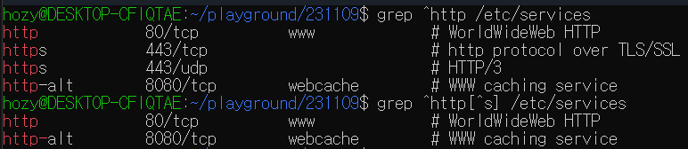
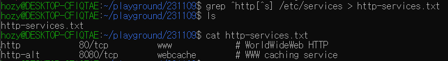
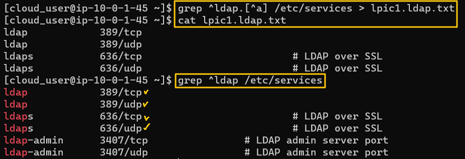
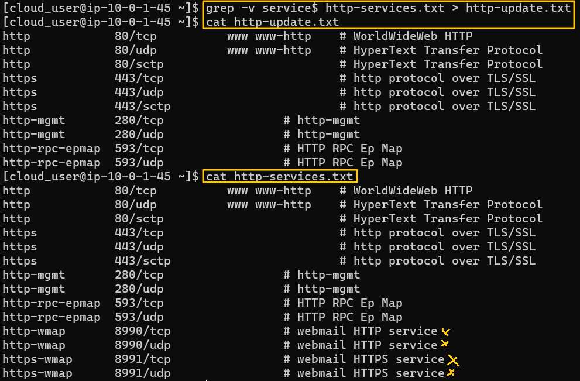

[Back to Linux Main](../main.md)

# Regular Expression in Linux
Some tasks using grep with the regular expressions

### Mission 1) 
- Objective
  - At /etc/services, find files which names start with "http" and the fifth character of them are not s and save the result in file http-services.txt at home directory.
- How?
  - The regular expression will be "^http[^s]"
  - Search with grep using the regular expression and output the result in a file.
    ```
    grep [regex] [searching_dir] > [output_file]
    ```
- Hands on
  1. Search the /etc/services.
     
  2. Output the search result into a file.
     

<br>

### Mission 2) 
- Objective
  - At /etc/services, find files such that 
    - start with ldap, 5-th char can be anything
    - the 6th char must not be a"
  - Output it to "lpic1-ldap.txt" at the home directory
- How?
  - Regular Expression : ^ldap.[^a]
- Hands on
  


<br>

### Mission 3) 
- Objective
  - In http-services.txt file, find every line that does not end with "service"
  - Save the result in the file "http-updated.txt"
- How?
  - Regular Expression : service$
  - grep option : -v --invert-match
- Hands on
  


<br>

[Back to Linux Main](../main.md)