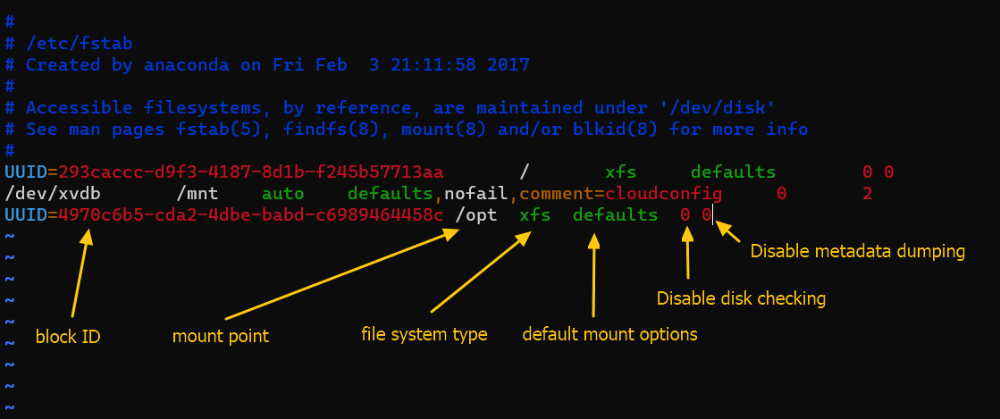

[Back to Linux Main](../main.md)

# Adding a New Hard Disk to a Linux System

### Objective
- Add a new disk drive to a system
- Create a file system on that drive
- Have it permanently mounted via the /etc/fstab file

<br>

### Hands on 
- Make sure that the disk is attached to the system
  ```
  lsblk
  ```
  

- Add the new disk.
  ```
  sudo fdisk /dev/[disk_name]
  ```
  


- Create a new xfs file system.
  ```
  sudo mkfs.xfs /dev/[disk_name][partition_num]
  ```
  

- Obtain the block ID for this partition.
  ```
  sudo blkid /dev/[disk_name][partition_num]
  ```
  
  - Copy the above UUID so that we can paste it to /etc/fstab

- Copy the above block ID to /etc/fstab.
  

- Mount the disk and run free command to guarantee 5.0GB space available.
  


<br>

[Back to Linux Main](../main.md)