[Back to Linux Main](../main.md)

# CUPS Print Server

### Objective
- Install a PDF printer.
- Print a test page.
- Modify the printer and work with the print queue.

<br>

### Hands on
- Check the printers already installed
  ```
  lpstat -s
  ```
  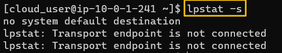

- See available printer connections.
  ```
  sudo lpinfo -v
  ```
  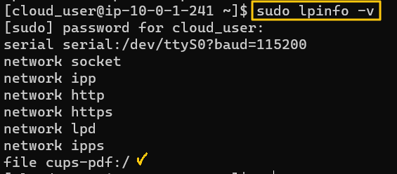   
  - To set PDF printer, "file cups-pdf" must be available.
- Install CUPS.
  ```
  sudo lpadmin -p CUPS-PDF -v cups-pdf:/
  ```
  
  - Options   
    ```-p <name>``` : Set the name of the printer   
    ```-v <type>``` : Set the connection type
- Determine what driver file to use for the printer.
  - First, query DB for the drivers.
    ```
    lpinfo --make-and-model "PDF" -m
    ```
    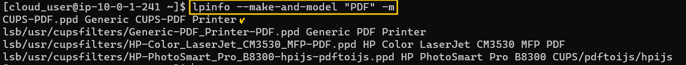
  - Next, specify the driver for the previous CUPS-PDF
    ```
    sudo lpadmin -p CUPS-PDF -m "CUPS-PDF.ppd"
    ```
    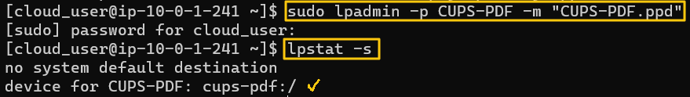
- Check the status of the printer that we just installed.
  ```
  lpc status
  ```
  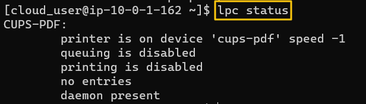
- Enable the printer.
  ```
  sudo lpadmin -d CUPS-PDF -E
  ```
  ```
  sudo cupsenable CUPS-PDF
  ```
  ```
  sudo cupsaccept CUPS-PDF
  ```
  ```
  lpc status
  ```
  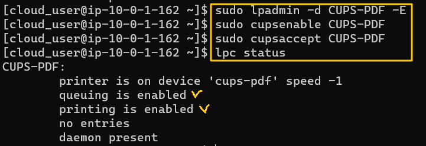

- Test Printing : Print /etc/passwd to the home directory.
  ```
  lpr /etc/passwd
  ```
  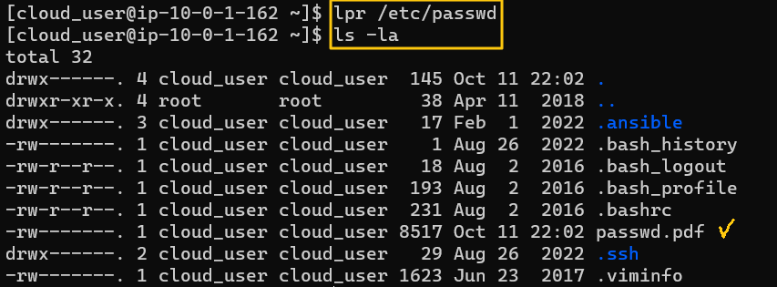


- Disabling the printer.
  - cf.) We should disable the printer when we don't use it.
  - Two types of Disabling
    1. Queueing Disabled : Not accepting the job
       ```
       sudo cupsreject CUPS-PDF
       ```
       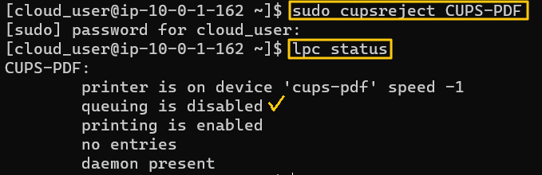
       - We can enable anytime with the following command.
         ```
         sudo cupsaccept CUPS-PDF
         ```
    2. Printing Disabled : Accepting the job to the queue but NOT printing
       ```
       sudo cupsdisable CUPS-PDF
       ```
       - Test whether the printer is properly disabled.
         |Command|Screen Shot|Explanation|
         |:------|:----------|:----------|
         |<code>sudo cupsdisable CUPS-PDF</code><br><code>lpc status</code>|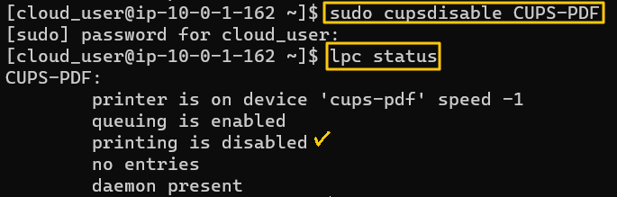||
         |<code>lpr /etc/group</code><br><code>ls</code>|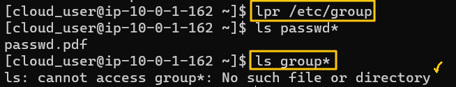|Not printed!|
         |<code>lpq</code>|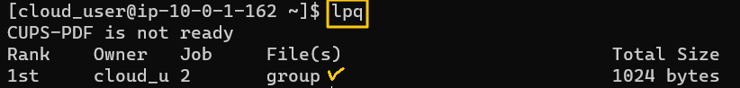|Not printed but the job remains in the queue.|
         |<code>lprm [job_number]</code><br><code>lpq</code>|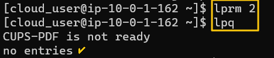|Remove the job using the job number.|
         |<code>sudo cupsenable CUPS-PDF</code><br><code>lpq</code>|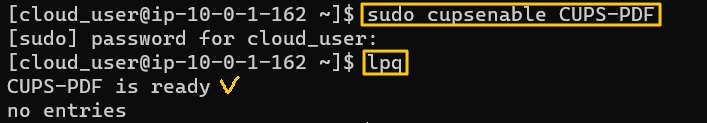|We can always enable the printer.|


<br>

[Back to Linux Main](../main.md)