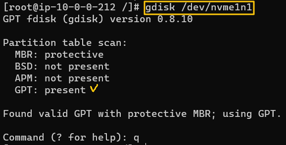
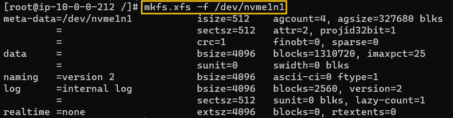
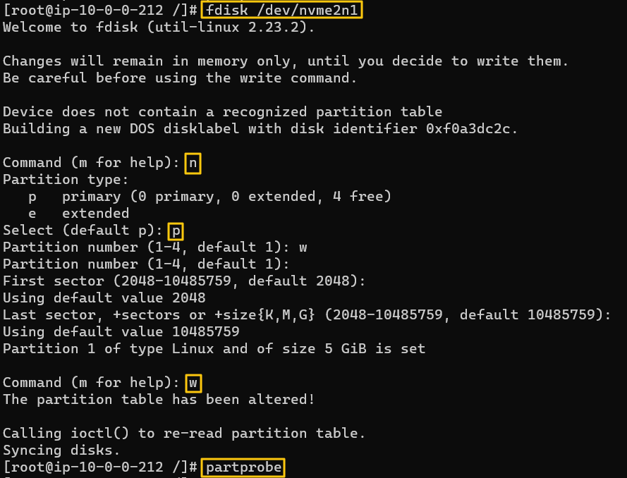

[Back to Linux Main](../main.md)

# Storage Management

## Objective
- Managing and formatting partitions
  - GPT partition 
    - [Creating](#creating-a-gpt-partition) : gdisk
    - [Formatting](#formatting-a-gpt-partition) : xfs
  - MBR partition
    - [Creating](#creating-a-mbr-partition) : fdisk
    - [Formatting](#formatting-a-mbr-partition) : ext4

<br>

## Hands on
- Check existing disks.
  ```
  ls -la /dev | grep disk
  ```
  

<br>

### Creating a GPT Partition
- Create a GPT partition on */dev/nvme1n1*.
  ```
  gdisk [target_disk]
  ```
  
- Inform the OS that the partition table changed.
  ```
  partprobe
  ```
  
  - Recommended after running a partitioning related operation
- Check the newly created disk is recognized.
  ```
  gdisk [target_disk]
  ```
  

<br>

### Formatting a GPT Partition
- Format the GPT partition with XFS and mount on */mnt/gptxfs* persistently.
  ```
  mkfs.xfs -f [target_disk]
  ```
  
- Get the UUID of the partition
  ```
  blkid
  ```
  
- Edit */etc/fstab*.
  
- Make directory and mount it.
  ```
  mkdir [target_dir]
  ```
  ```
  mount -a
  ```
  
  - Check the result.
    ```
    mount
    ```
       
    ...   
    

  

<br>

### Creating a MBR Partition
- Create a MBR partition on */dev/nvme2n1*
  ```
  fdisk [target_disk]
  ```
  
- Inform the OS that the partition table changed.
  ```
  partprobe
  ```
- Check the result.
  ```
  gdisk [target_disk]
  ```
  

<br>

### Formatting a MBR Partition
- Format the MBR partition with ext4 and mount it on */mnt/ext4.*
  ```
  mkfs.ext4 [target_disk]
  ```
  
- Make target directory and mount.
  ```
  mkdir [target_dir]
  ```
  ```
  mount [target_disk] [target_dir]
  ```
  
  - Check the result.
    ```
    mount
    ```
       
    ...   
       


<br>

[Back to Linux Main](../main.md)