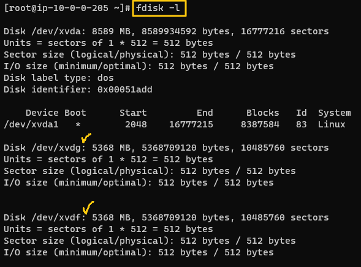

# LVM Storage

### Objective
Learn how to use the LVM management tool.   
* How?
  * Create a large logical volume in the two disks attached to the server.
  * Grow the size of the logical volume with file system mounted on it.

<br>

### Hands-On
* Use the root user
    ```
    sudo -i
    ```

* Check the disks
    ```
    fdisk -l
    ```
    
    * We have xvdg and xvdf
