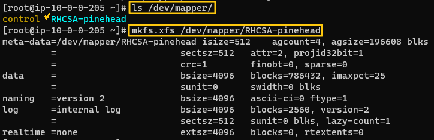

# LVM Storage

### Objective
Learn how to use the LVM management tool.   
* How?
  * Create a large logical volume in the two disks attached to the server.
  * Grow the size of the logical volume with file system mounted on it.

<br>

### Hands-On
* Use the root user
    ```
    sudo -i
    ```

* Check the disks
    ```
    fdisk -l
    ```
    
    * We have xvdg and xvdf

* Create a physical device (volume)
  ```
  pvcreate <disk1> <disk2> ...
  ```
  
  * Verify the devices that we've created.
    ```
    pvs
    ```
    
    ```
    pvdisplay
    ```
    

* Create a volume group and check.
  ```
  vgcreate <volume_group_name> <volume1> <volume2> ...
  vgdisplay
  ```
  

* Create a logical volume and check
  ```
  lvcreate -n <logical_volume_name> -L <size> <volume_group_name>
  lvdisplay
  ```
  

* Format the logical volume using xfs
  * Use the /dev/mapper
    ```
    ls /dev/mapper
    mkfs.xfs /dev/mapper/<volume_group_name>-<logical_volume_name>
    ```
    
  * Make the directory that our logical volume will be mounted.
    ```
    mkdir /mnt/lvol
    ```
  * Get the UUID of the logical volume and paste it to /etc/fstab
    ```
    blkid
    vim /etc/fstab
    ```
    
    
  * Mount the volume
    ```
    mount -a
    ```

* Extend the logical volume by 200MB.
  * There are two ways to to this.
    1. Use the lvextend command.
        ```
        lvextend -L+<intended_size> <logical_volume_location>
        ```
        
    2. Use the xfs_growfs command.
        ```
        xfs_growfs <mounted_directory>
        ```
           
           