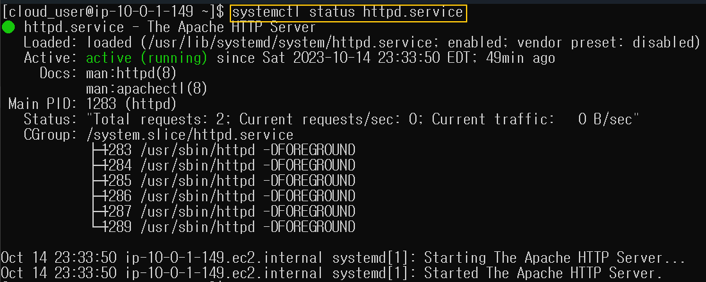
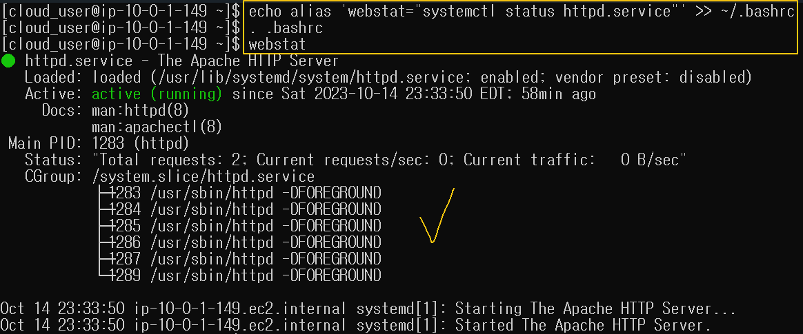
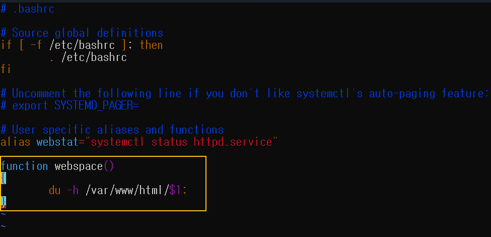
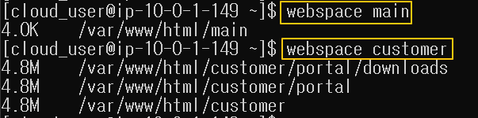

[Back to Linux Main](../main.md)

# Modifying the Bash Shell

### Bash Shell
The Bash shell is the default command line interface used on the vast majority of Linux distributions.   
* Applications
  * Provide own aliases to commonly used commands and options
  * Create own functions to use in the Bash environment. 

<br>

### Objectives
1. Create an alias to view the status of the httpd servers. 
2. Create a function that views the disks.

<br>

### Hands on
#### 1. Create an alias
* Check the command that we will set an alias for.
    ```
    systemctl status httpd.service
    ```
    

<br>

* Create an alias with the name "webstat" to ~/.bashrc
  ```
  echo alias 'webstat="systemctl status httpd.service"' >> ~/.bashrc
  ```

* Source the .bashrc using the dot(.) command.
  ```
  . .bashrc
  ```
  * Why doing this?)
    * We need to tell bash that we will use it.
  * bash is refreshed now.
* Test if the alias is working.
  ```
  webstat
  ```
  

<br><br>

#### 2. Create a function
* Function info
  * name : webspace
  * input : <directory>
  * output : disk space info

Add the function to ~/.bashrc using vim.   

* /var/www/html/ is the directory of all the webservers in this example.
* Thus, if we give the name of folder that contains a target server to this function, it will run the du -h command for that server.

Source the .bashrc file
```
. .bashrc
```

Test!   



<br>

[Back to Linux Main](../main.md)