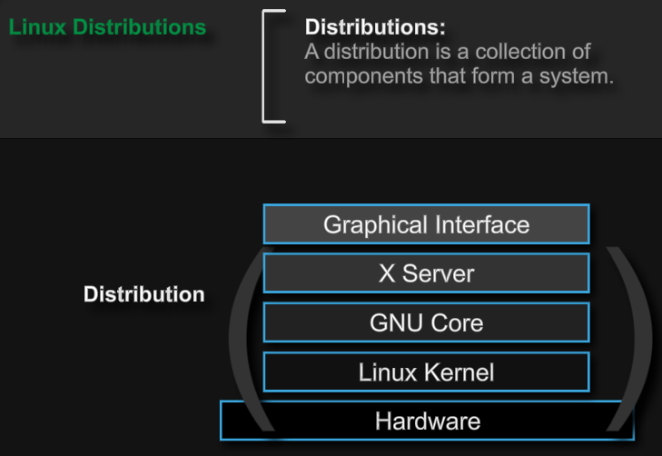

[Back to Linux Overview Main](../main.md)

# Linux Distributions

 

### Concept) Distributions

 

### Concept) X Server

 

### Concept) GNU Core Utilities

 

### Concept) Linux Kernel

 

[Back to Linux Overview Main](../main.md)