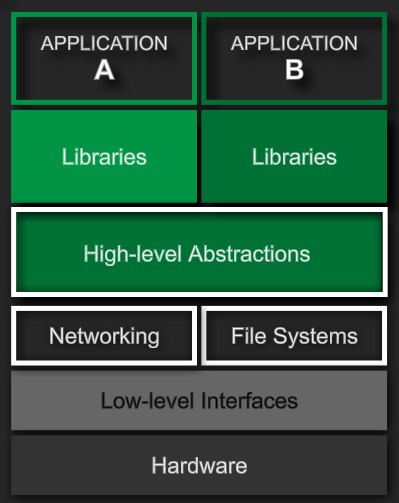

[Back to LPI Main](../main.md)

# Linux-Embedded Systems

 

### Concept) Embedded Systems
A combination of HW and SW for a purpose
- Architecture)   
  
- e.g.)
  - Google Android
  - Raspberry Pi
    - Raspbian based on Debian

 

 

[Back to LPI Main](../main.md)