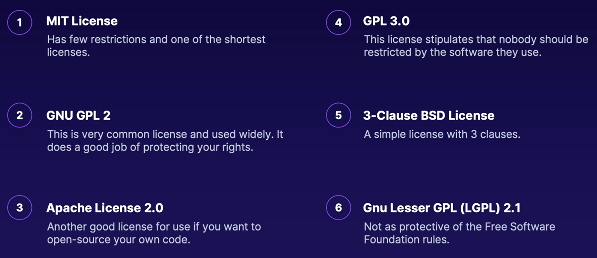

[Back to Linux Main](../main.md)

# Open Source

### Concept) Open Source
The source code is available for use.

 

### Concept) The Free Software Movement
- The GNU Project. Fully open source.
- Debian
- A library of code you can use.

 

### Concept) Popular Licenses

 

 

[Back to Linux Main](../main.md)