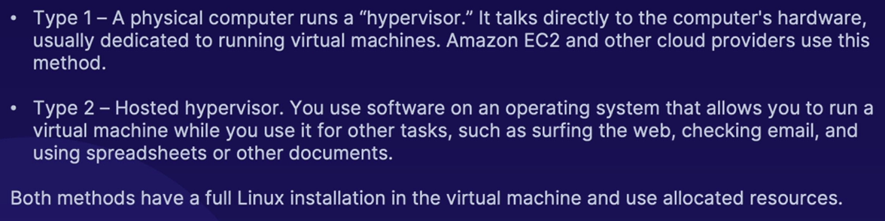

[Back to Linux Main](../main.md)

# Types of Linux

## Concept) Server Linux
- Props.)
  - No GUI
  - Less SW installed
  - Less to keep updated
  - Designed for throughput and reliability
  - Multiple redundancies
- Linux Usages)
  - Databases
  - Web Servers
  - Email Servers

 

## Concept) Desktop Linux
- Props.)
  - GUI
  - Low cost (Free distributions)
  - No need to upgrade
- Distributions)
  - Fedora
  - Ubuntu
  - CentOS

 

## Concept) Mobile Linux
- Props.)
  - Designed for mobile devices
  - Touch function supported
- Distributions
  - Android (open source)
  - iOS
  - Ubuntu Touch
  - postmarketOS
  - Sailfish OS
  - Mobian

 

## Concept) Hypervisor or Virtual
- Types)
  

 

## Concept) Different Architectures
- Types depending on CPUs)
  - x86 64-bit : The most common CPU
    - X64 (Intel) : Red Hat
    - amd64 (AMD) : Ubuntu
  - ARM64
  - Apple M1
- Linux Support for other CPUs
  - ARM
  - Risc
  - PowerPC

 

 

[Back to Linux Main](../main.md)