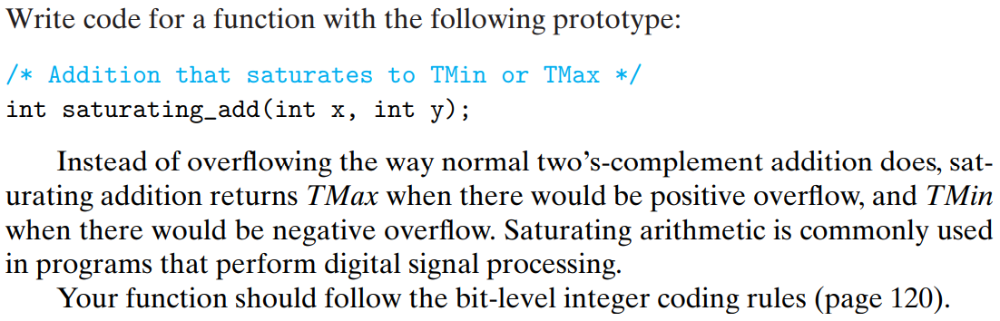
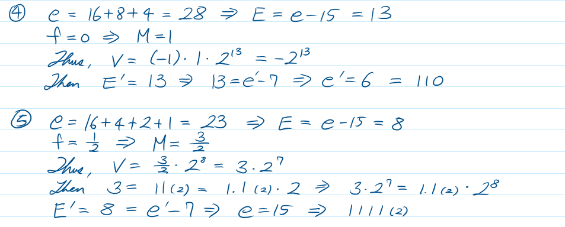
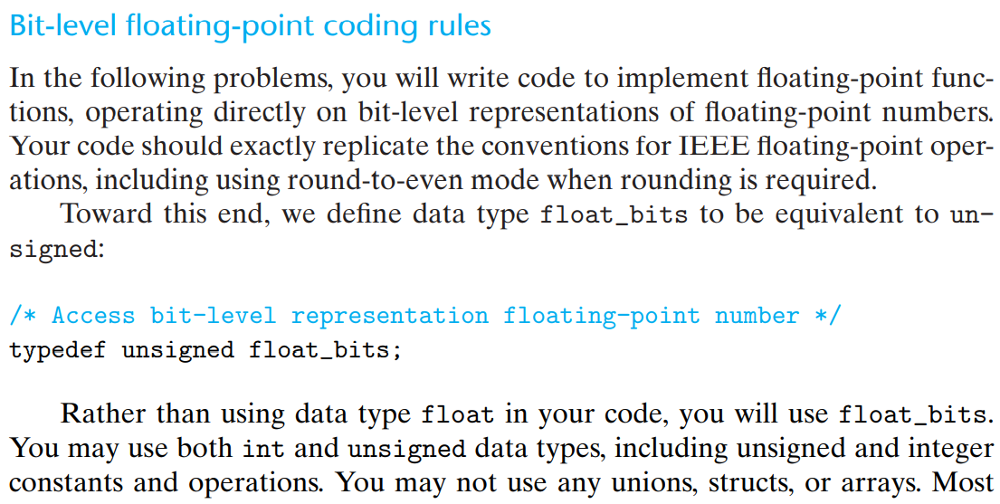

[Back to index](../../main.md)

# Homework Problems

## 2.55
#### Compile and run the sample code that uses show_bytes (file show-bytes.c) on different machines to which you have access. Determine the byte orderings used by these machines.
* TBD

## 2.56
#### Try running the code for show_bytes for different sample values.
* [Sol](./hw_problems/56.c)

## 2.57
#### Write procedures show_short, show_long, and show_double that print the byte representations of C objects of types short int, long int, and double, respectively. Try these out on several machines.
* [Sol](./hw_problems/57.c)

## 2.58
#### Write a procedure is_little_endian that will return 1 when compiled and run on a little-endian machine, and will return 0 when compiled and run on a big-endian machine. This program should run on any machine, regardless of its word size.
* [Sol](./hw_problems/58.c)

## 2.59
#### Write a C expression that will yield a word consisting of the least significant byte of x, and the remaining bytes of y. For operands x = 0x89ABCDEF and y = 0x76543210, this would give 0x765432EF.
* [Sol](./hw_problems/59.c)

## 2.60

* [Sol](./hw_problems/60.c)

---

---

## 2.61

* [Sol](./hw_problems/61.c)

## 2.62

* [Sol](./hw_problems/62.c)

## 2.63

* [Sol](./hw_problems/63.c)

## 2.64

* [Sol](./hw_problems/64.c)

## 2.65

* [Sol](./hw_problems/65.c)

## 2.66

* [Sol](./hw_problems/66.c)

## 2.67

* Sol.
A. According to C11 Standard, _if the value of the right operand is negative or is greater than or equal to the width of the promoted left operand, the behavior it undefined._
B. [Sol](./hw_problems/67.c)
C. [Sol](./hw_problems/67.c)

## 2.68

* [Sol](./hw_problems/68.c)

## 2.69

* [Sol](./hw_problems/69.c)

## 2.70

* [Sol](./hw_problems/70.c)

## 2.71

* Sol.
A. Negative bytes will not be properly returned.
B. [Sol](./hw_problems/71.c)

## 2.72

* Sol.
A. Recall that sizeof() function returns unsigned integer datatype size_t and the result of the operation between signed and unsigned is unsigned. Thus, the subtraction result is always positive.
B. [Sol](./hw_problems/72.c)

## 2.73

* [Sol](./hw_problems/73.c)

## 2.74

* [Sol](./hw_problems/74.c)

## 2.75

* [Sol](./hw_problems/75.c)

## 2.76

* Sol
A. (1 << 4) + 1
B. 1 - (1 << 3)
C. (1 << 6) - (1 << 2)
D. (1 << 4) - (1 << 7)

## 2.77

* [Sol](./hw_problems/77.c)

## 2.78

* [Sol](./hw_problems/78.c)

## 2.79

* [Sol](./hw_problems/78.c)

## 2.80

* [Sol](./hw_problems/80.c)

## 2.81

* Sol   

## 2.82

* Sol   

## 2.83

* [Sol](./hw_problems/83.c)

## 2.84

* Sol   

## 2.85

* Sol   

## 2.86

## 2.87

* Sol   

## 2.88

* [Sol](./hw_problems/88.c)

## 2.89

* [Sol](./hw_problems/89.c)

## 2.90

* [Sol](./hw_problems/90_sol.png)

---

   

---

## 2.91

* [Sol](./hw_problems/91.c)

## 2.92

* [Sol](./hw_problems/92.c)

 
## 2.93

* [Sol](./hw_problems/93.c)

 
## 2.94

* [Sol](./hw_problems/94.c)

 
## 2.95

* [Sol](./hw_problems/95.c)

 
## 2.96

* [Sol](./hw_problems/96.c)

[Back to index](../../main.md)