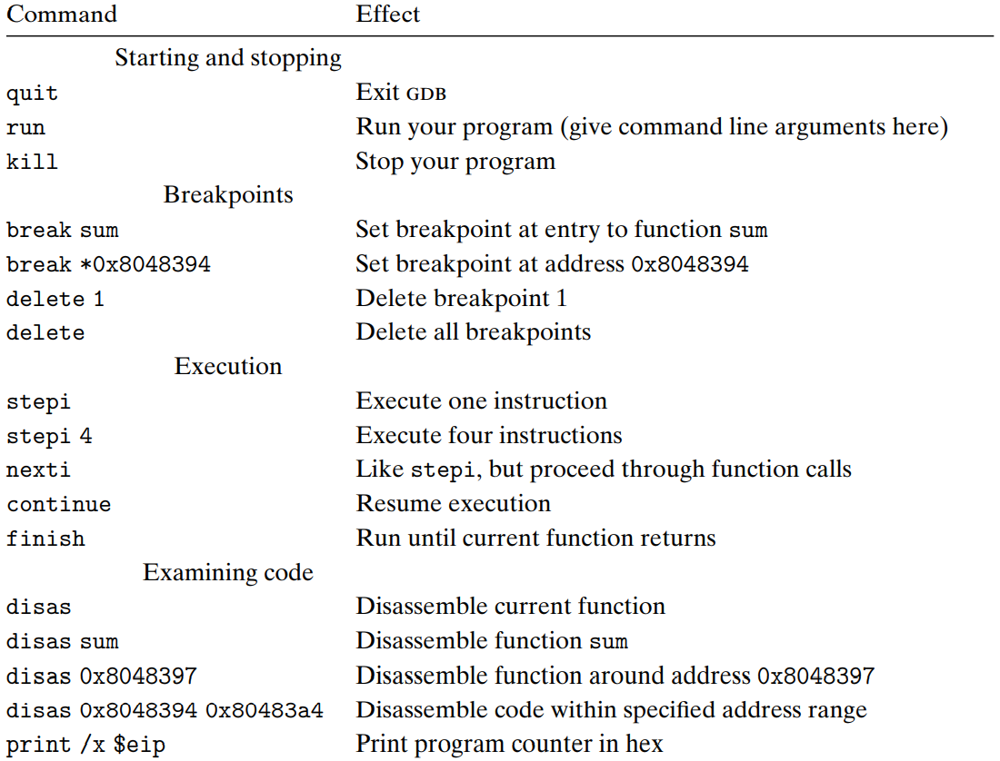
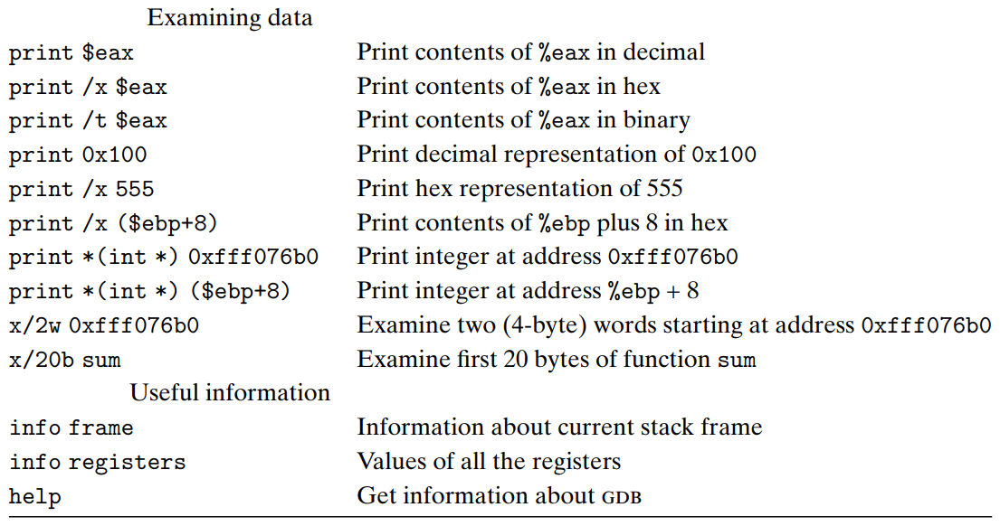

[Back to index](../../main.md)

# 3.11 Life in the Real World: Using GDB Debugger

### Concept) GDB Debugger
* Def.) A debugger provided by GNU
* Tech.) Commands
  
  

### KEYWORDS
* GDB Debugger;

[Back to index](../../main.md)