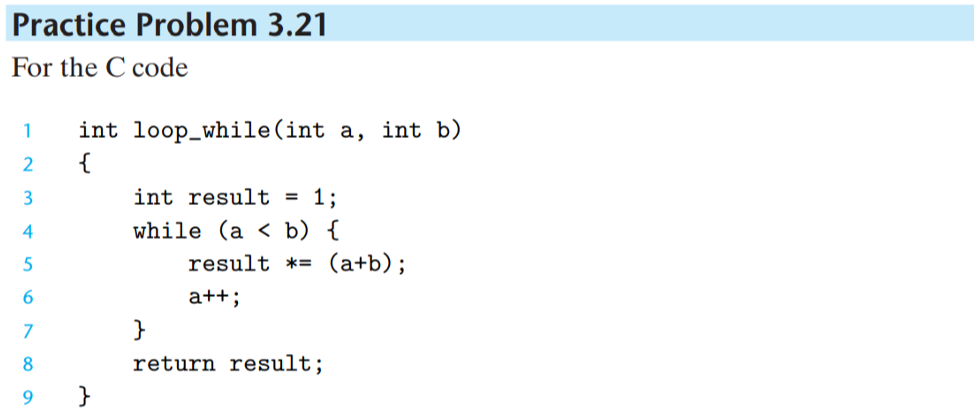

[Back to index](../../main.md)


### ◈ Practice Problem 3.1


### ◈ Practice Problem 3.2

* Sol.
  ```assembly
  movl %eax, (%esp)
  movw (%eax), %dx
  movb $0xFF, %bl
  movb (%esp, %edx, 4), %dh
  pushl $0xFF
  movw %dx, (%eax)
  popl %edi
  ```

### ◈ Practice Problem 3.3


### ◈ Practice Problem 3.4


### ◈ Practice Problem 3.5

* Sol.
  ```c
  void decode1(int *xp, int *yp, int *zp){
    int a = *yp;
    int b = *zp;
    int c = *xp;
    
    *yp = c;
    *zp = a;
    *xp = b;
  }
  ```

### ◈ Practice Problem 3.6


### ◈ Practice Problem 3.7


### ◈ Practice Problem 3.8

* Sol.
  ```assembly
  movl 8(%ebp), %eax
  sall $2, %eax

  movl 12(%ebp), %ecx
  sarl (%cl), %eax

  ```

### ◈ Practice Problem 3.9


### ◈ Practice Problem 3.10

* Sol.   
A. The value on %edx becomes 0.   
B.   
  ```assembly 
  movl $0, %edx 
  ```   
C.   
* "mov $0, %edx" requires 5 bytes.
  * 1 byte for "mov imm32, %edx" 
  * 4 bytes of $0 (immediate)
* "xor %edx, %edx" requires 2 bytes.
  * 1 byte for "xor r32, r/m32
  * 1 byte for operand

### ◈ Practice Problem 3.11

* Sol.   
  ```assembly
  movl 8(%ebp), %eax
  xorl %edx, %edx
  divl 12(%ebp)
  movl %eax, 4(%esp)
  movl %edx, %esp
  ```

### ◈ Practice Problem 3.12

 

### ◈ Practice Problem 3.13


### ◈ Practice Problem 3.14


### ◈ Practice Problem 3.15


### ◈ Practice Problem 3.16

* Sol.
A.
```c
void cond(int a, int *p){
  if (p){
    goto done;    
  }
  if (a <= 0){
    *p += a;
  }
done:
  return;
}
```

B. Due to && operation, we should check two conditions.


### ◈ Practice Problem 3.17

* Sol.
A. 
```c
int absdiff(int x, int y){
  int result;
  if (x < y){
    goto x_l_y;
  }
  result = y-x;
  goto done;
x_l_y:
  result = x-y;
done:
  return result;
}
```

B. In specific cases the result of the condition is not equivalent.


### ◈ Practice Problem 3.18

* Sol
  ```c
  int test(int x, int y){
    int val = x;
    if (x+3 < 0){
      if (x - y > 0){
        val *= y;
      } else {
        val = x + y;
      }
    } else {
      if (x-2 <= 0){
        val ^= y;
      } else {
        val -= y;
      }
    }
    return val;
  }
  ```


### ◈ Practice Problem 3.19

* Sol
A. 1932053504
  ```c
  #include <stdio.h>

  int main(){
      int num = 1;
      int n = 2;
      while (num < num*n){
          num *= n;
          printf("%d\n", num);
          n++;
      }

      printf("Final result : %d\n", num);
  }
  ```

B. 2432902008176640000
```c
#include <stdio.h>

int main(){
    long long lnum = 1;
    long long ln = 2;
    while (lnum < lnum*ln){
        lnum *= ln;
        printf("%lld\n", lnum);
        ln++;
    }

    printf("Final result : %lld\n", lnum);
}
```


### ◈ Practice Problem 3.20

* Sol.
  1. Table
     |Register|Variable|Initially|
     |:------:|:------:|:-------:|
     |%eax|x|x|
     |%ecx|y|y|
     |%edx|n|n|
  2. 
     |Statement|C line #|Assembly line #|
     |:-------|:------:|:-------:|
     |test-expr|6|9, 11|
     |body-statement|3 ~ 5|6 ~ 7|


### ◈ Practice Problem 3.21


* Sol.
  1. The value of (a+b) is assigned to %edx.
  2. Table
     |Register|Variable|Initially|
     |:------:|:------:|:-------:|
     |%eax|result|1|
     |%ebx|b|b|
     |%ecx|a|a|
     |%edx|(new variable)|(a+b)|
  3. Annotated above.
  4. goto code.
     ```c
     int loop_goto(int a, int b){
      int result = 1;
      if (a < b){
        int c = a+b;
        result = 1;
      }
      loop:
        result *= c;
        a++;
        c++;
        if (b - a > 0){
          goto loop;
        }
      return result;
     }
     ```


### ◈ Practice Problem 3.22

* Sol.
  1. C code
     ```c
     int fun_a(unsigned x){
      int val = 0;
      while (x > 0){
        val ^= x;
        x >>= 1;
      }
      val &= 1;
      return val;
     }
     ```
  2. If the number of ones in the binary form is odd, fun_a() returns 1. Else, it returns 0.

### ◈ Practice Problem 3.23

* Sol.
  1. C code
     ```c
     int fun_b(unsigned x){
      int val = 0;
      int i;
      for (i=0; i<32; i++){
        val = (x + 1) | 2*val;
        x >>= 1;
      }
      return val;
     }
     ```
  2. fun_b() returns the reversed binary value of the input.


### ◈ Practice Problem 3.24

* Sol.
  1. Do-while application.
     ```c
     int sum = 0;
     int i = -1;
     do {
      i++;
      if (i & 1){
        continue;
      }
      sum += i;
     } while (i < 10);     
     ```
  2. Safer goto version
     ```c
     int sum = 0;
     int i = -1;
     loop:
      if (i >= 10){
        goto done;
      }
      i++;
      if (i & 1){
        goto loop;
      }
      sum += i;     
     done:
     ```


### ◈ Practice Problem 3.25


### ◈ Practice Problem 3.26

* Sol.
  1. Division by 4. Bias, (2^k - 1), is added for the negative number case.
  2. Annotated above.

### ◈ Practice Problem 3.27

* Sol.
  ```c
  int test(int x, int y){
    int val = x ^ y;
    if (y <= 0){
      if (y >= -2){
        val = 4*x;
      } else {
        val = x + y;
      }
    } else if (x < y){
      val = x - y;
    }
    return val;
  }
  ```

### ◈ Practice Problem 3.28


### ◈ Practice Problem 3.29

<table>
  <tr>
    <td>
      
    </td>
    <td>
      
    </td>
  </tr>
</table>

* Sol
  ```c
  int switcher(int a, int b, int c){
    int answer;
    switch (a){
      case 5:
        c = b ^ 15;      
      case 0:
        answer = c + 112;
        break;    
      case 2: 
      case 7:
        answer = (b + c) << 2;
        break;
      case 4:
        answer = 4;
        break;
      default:
        answer = b;
    }
    return answer;
  }
  ```

### ◈ Practice Problem 3.30

* Sol.
  1. %eax is set to the address of the popl instruction.
  2. This is not a true procedure call, since the control follows the same ordering as the instructions and the return address is popped from the stack.
  3. This is the only way in IA32 to get the value of the program counter into an integer register.


### ◈ Practice Problem 3.31

* Sol.
  * It's because the values in %ebx, %esi, %edi are stored in the program stack and recovered when the procedure is over. On the other hand, the data on the caller-save registers are not backed-up.


### ◈ Practice Problem 3.32

* Sol
  ```c
  int fun(short m, char n, int *p, int x){
    int d = (int) n;
    int c = (int) m;
    *p = d;
    return x - c
  }
  ```


### ◈ Practice Problem 3.33

* Sol
  1. 0x80003C
     * why?) Decrement 4 from %esp : 0x800040 - 4 = 0x80003C.
  2. 0x800014
     * why?) 40 = 0x28. Thus, 0x80003C - 0x28 = 0x800014.
  3. 0x800036 for x and 0x800032 for y
  4. image below...   
     
  5. 0x800020 ~ 0x800030


### ◈ Practice Problem 3.34

* Sol.
  1. the input parameter x
  2. C code
     ```c
     int rfun(unsigned x){
      if (x == 0){
        return 0;
      }
      unsigned nx = x >> 1;
      int rv = rfun(nx);
      return rv + (x & 1);
     }
     ```
  3. Sum of every bits in a number.


### ◈ Practice Problem 3.35


### ◈ Practice Problem 3.36


### ◈ Practice Problem 3.37

* Sol.
  * M = 5, N = 7


### ◈ Practice Problem 3.38

* Sol.
  ```c
  void fix_set_diag_opt(fix_matrix A, int val){
    int *Aptr = &A[0][0];
    int i;

    for (i=0; i<N; i++){
      *Aptr = val;
      Aptr += N;
      Aptr++;
    }
  }
  ```


### ◈ Practice Problem 3.39


* Sol.
  ```c
  void sp_init(struct prob *sp){
    sp->s.x = sp->s.y;
    sp->p = &(sp->s.x);
    sp->next = sp;
  }
  ```


### ◈ Practice Problem 3.40


### ◈ Practice Problem 3.41

* Sol.
  1. Total 16 bytes   
     |int i|char c|int j|char d|
     |-----|------|-----|------|
     |0|4|8|12|
  2. Total 10 bytes   
     |int i|char c|char d|int j|
     |-----|------|------|-----|
     |0|4|5|6|
  3. Total 12 bytes   
     |short w[0]|short w[1]|short w[2]|char c[0]|char c[1]|char c[2]|
     |-|-|-|-|-|-|
     |0|2|4|6|7|8|
  4. Total 18 bytes   
     |short w[0]|short w[1]|short w[2]|char *c[0]|char *c[1]|char *c[2]|
     |-|-|-|-|-|-|
     |0|2|4|6|10|12|
  5. Total 36 bytes   
     |struct P1 a[0]|struct P1 a[1]|struct P1 *p| 
     |-|-|-|
     |0|16|32|


### ◈ Practice Problem 3.42

* Sol.
  1. Offsets
     | |char *a|short b|double c|char d|float e|char f|long long g|void *h|
     |-|:-:|:-:|:-:|:-:|:-:|:-:|:-:|:-:|
     |Size  |4|**2**|8|1 |4 |1 |8 |4 |
     |Offset|0|4|**8**|16|20|24|28|36|
  2. 40 bytes
  3. If rearranged as follows, the total size can be reduced to 32 bytes.
     ||char *a|short b|char d|char f|double c|float e|long long g|void *h|
     |-|:-:|:-:|:-:|:-:|:-:|:-:|:-:|:-:|
     |Offset|0|4|6|7|8|16|20|28|


### ◈ Practice Problem 3.43


### ◈ Practice Problem 3.44

* Sol.
  1. 0xffffd754 - 0xffffb754 = 0x00002000 = 2^(4 * 3) * 2 = 2^13
  2. 2^6 = 64


### ◈ Practice Problem 3.45


* Sol.
  1. -
     1. Without protector
        * buf : -20 relative to %ebp
        * v : -8 relative to %ebp
     2. With protector
        * buf : -20 relative to %ebp
        * v : -24 relative to %ebp
        * canary : -8 relative to %ebp
  2. -
     ```c
     int intlen(int x){
      int v;
      v = x;
      char buf[12];
      iptoa(buf, &v);
      return len(buf);
     }
     ```


### ◈ Practice Problem 3.46

* Sol
  ```c
  #include <stdio.h>

  int problem_A(){
      double tera_by_mega_256 = 1000000*256;
      tera_by_mega_256 *= 8000;
      int years_cnt = 0;
      while (tera_by_mega_256 > 1000){
          tera_by_mega_256 /= 1.48;
          years_cnt++;
          // printf("Price : %lf / Yrs Took : %d\n", tera_by_mega_256, years_cnt);
      }
      return years_cnt;
  }

  int problem_B(){
      double exa_by_mega_16 = 1000000000000*16;
      exa_by_mega_16 *= 8000;
      int years_cnt = 0;
      while (exa_by_mega_16 > 1000){
          exa_by_mega_16 /= 1.48;
          years_cnt++;
          // printf("Price : %lf / Yrs Took : %d\n", exa_by_mega_16, years_cnt);
      }
      return years_cnt;
  }

  void problem_C(){
      double tera_by_mega_256 = 1000000*256;
      tera_by_mega_256 *= 8000;
      int years_cnt = 0;
      while (tera_by_mega_256 > 10000){
          tera_by_mega_256 /= 1.48;
          years_cnt++;        
      }
      printf("Price : %lf / Yrs Took : %d\n", tera_by_mega_256, years_cnt);
      
      double exa_by_mega_16 = 1000000000000*16;
      exa_by_mega_16 *= 8000;
      years_cnt = 0;
      while (exa_by_mega_16 > 10000){
          exa_by_mega_16 /= 1.48;
          years_cnt++;
      }
      printf("Price : %lf / Yrs Took : %d\n", exa_by_mega_16, years_cnt);
  }

  int main() {
      printf("A. %d\n", problem_A());
      printf("B. %d\n", problem_B());
      problem_C();

  }
  ```


### ◈ Practice Problem 3.47


### ◈ Practice Problem 3.48

* Sol
  ```c
  long int arithprob(int a, char b, long int c, int d){
    long int x = (long int) d * c;
    long int y = (long int) ((int) b * a);
    return x + y;
  }
  ```


[Back to index](../../main.md)