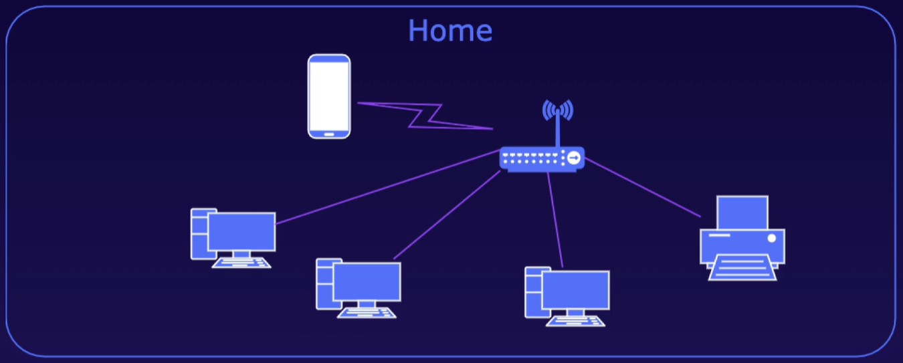
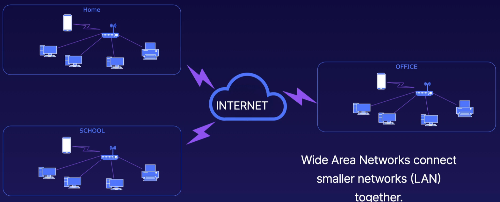
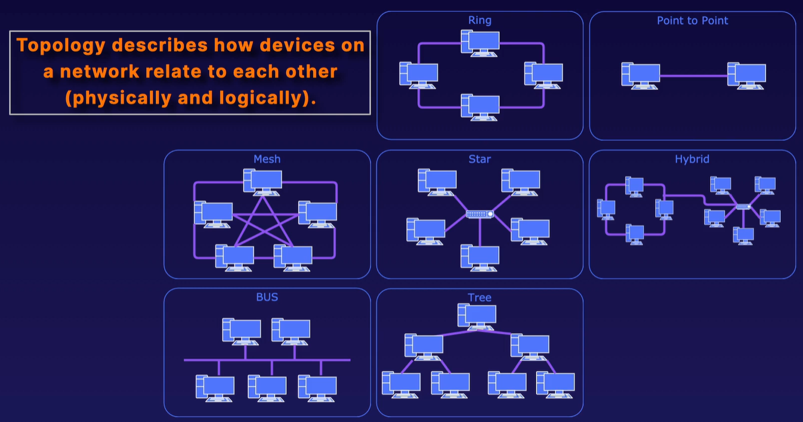

[Back to Linux Main](../main.md)

# Computer Network Basic Concepts

#### Concept) Local Area Network (LAN)
Computer network that connects devices in a limited area like a home, school, or office.   

 

#### Concept) Wide Area Network (WAN)
WAN connects LANs together.

 

#### Concept) Topology
- Def.)
  - Topology describes how devices on a network relate to each other.
- Types   
     
  - Ring
  - Point to Point
  - Mesh
  - Star
  - BUS
  - Tree
  - Hybrid

 

#### Concept) Network Building Blocks
- Components)
  - Devices
    - Each device has a unique MAC address
  - Connections
    - e.g.) cables, wireless
  - Switches
    - An equipment that connects individual devices in a network
  - Routers
    - An equipment that directs traffics from one network to another
  - Network Servers

 

[Back to Linux Main](../main.md)