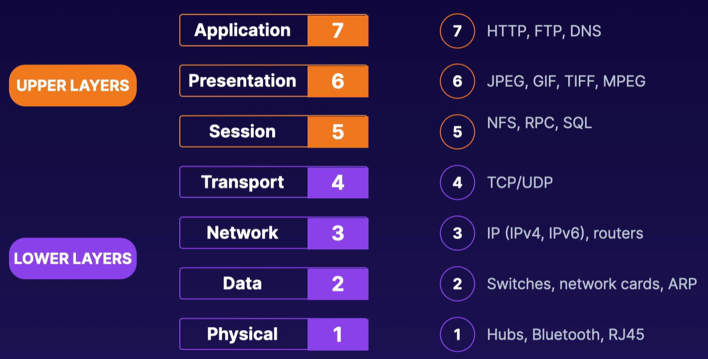

[Back to Linux Main](../main.md)

# The OSI Model

#### Concept) The OSI Model
- Def.)
  - An open systems interconnection model
  - Conceptual model formalized in the 1980s
  - Composed of seven layers.
- Why needed?)
  - Ensure the likelihood that different devices can communicate.
  - Isolate issues to a layer. Useful for trouble shooting.
- Layers)
  |No.|Name|Props.|
  |:-:|:--:|:-----|
  |7|Application|How an **application** interfaces with the network.   Web browser uses HTTP protocol.|
  |6|Presentation|Application data is **formatted** for delivery.   Translated into a common network language. (e.g. ASCII to binary or vice versa)|
  |5|Session|Starts and stops communication between parties.   Maintains the order of the traffics.   Separates the application data.|
  |||$\uparrow$ (Upper Layers) ---- (Lower Layers) $\downarrow$|
  |4|Transport|Packs up message and sends it.   Readies the messages between layers.   Ensures delivery of entire message.|
  |3|Network|Routes the data across various LANs and WANs|
  |2|Data|Network card on a computer.   Ensures dta received is same as data sent. (Integrity check)|
  |1|Physical|Transmission of data over the network cable.   e.g.) electrical signal|

 

#### Concept) Network Protocols
- A standardized way or set of rules for doing something on a computer network.
- Various kinds
  - network communication protocol
  - security protocol
  - network monitoring protocol
  - and so on...
- e.g.)
  - TCP, UDP, IP, HTTP, Ethernet, Bluetooth, DNS, etc

 

#### Concept) Network Services
- Programs or applications on a network that provides a service to users or devices on a network.
- e.g.)
  - DNS, email, chat, printer sharing, authentication, etc

 

 

[Back to Linux Main](../main.md)