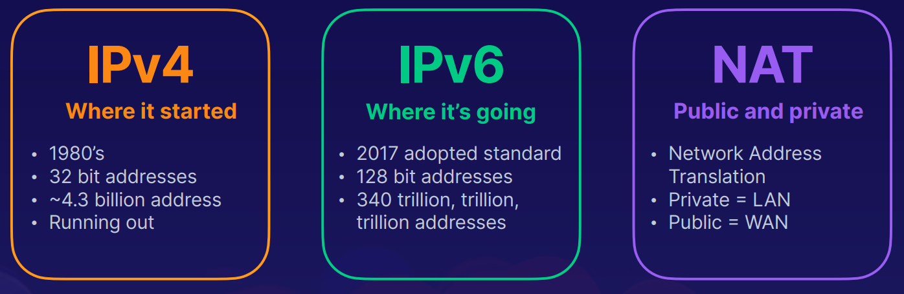
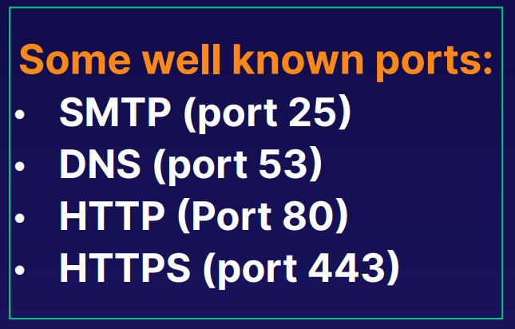
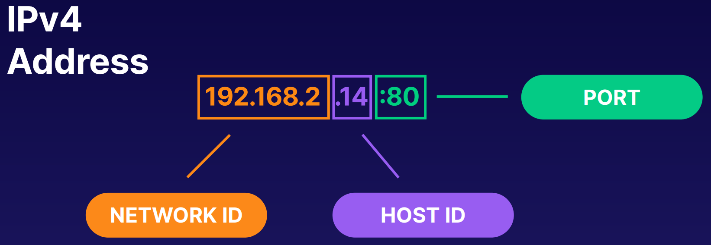
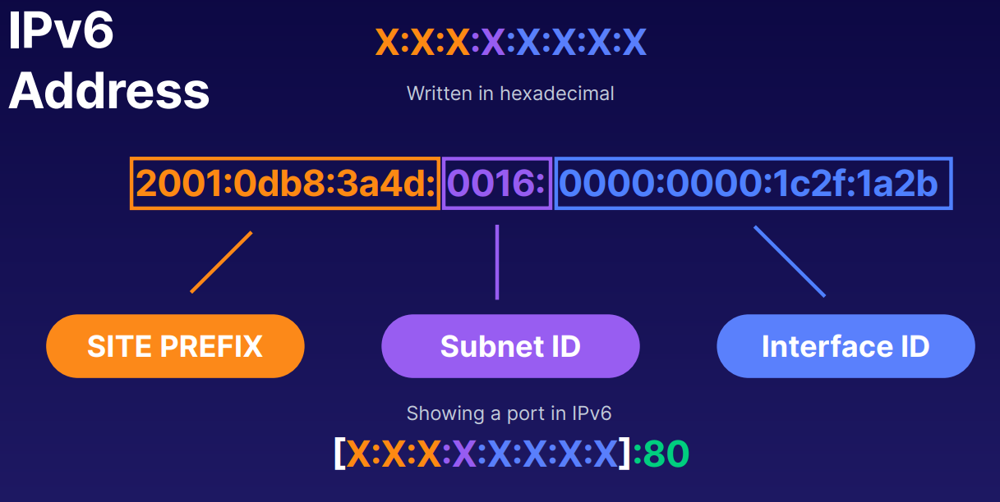
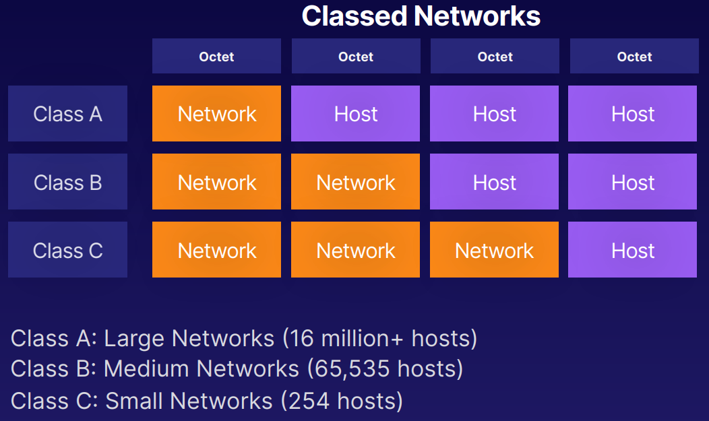
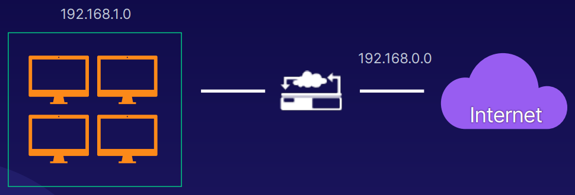
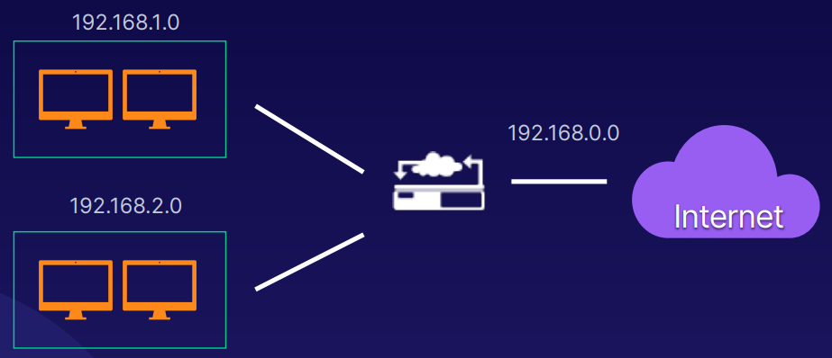

[Back to Linux Main](../main.md)

# IP Addressing

### Concept) IP Address
- A unique set of numbers that identifies a device on a network. 
- It is composed of network, host ID, and port.
- Types)
  

 

#### Concept) Network Port
- A number associated with an IP address and identifies an application or
service running on a networked device.
- There are 65535 ports. 
  - Ports 0-1023 are reserved ports used for well-known services.
    

 

#### Concept) IPv4 vs IPv6
|IPv4|IPv6|
|:----:|:---:|
|||

 

#### Concept) Network Classes

- Old style.
- Substituted by CIDR

 

#### Concept) IP Subnet
- Def. & Props.)
  - Dividing a network into smaller networks is called subnetting
  - Parts of the host portion of an IP address are changed to define the subnet address.
  - Subnet mask tells devices which portion of IP address to use for the subnet.
- Before and After subnetting
  |Before|After|
  |:----:|:---:|
  |||
- Why needed?)
  - Makes networks easier to manage
  - Better allocation of IP addresses in a limited range
  - Improved network performance
      

 

[Back to Linux Main](../main.md)