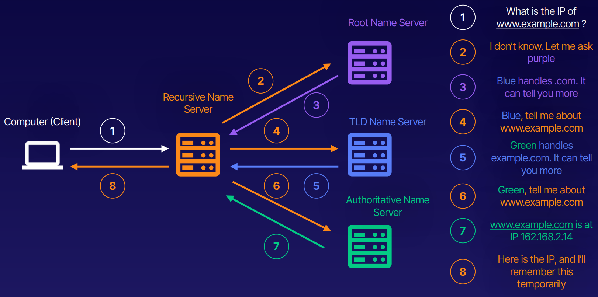

[Back to Linux Main](../main.md)

# DNS

### Concept) Domain Name Service (DNS)
- Desc.)
  - The “phone book” of networks.
  - It is a global network of servers that translates human-readable domains into a machine-readable IP address .
    - e.g.) example.com $\rightarrow$ 192.168.2.14
- Terms)
  - Domain Name
    - Human-readable name like acloud.guru or google.com. 
    - There are 4 main levels of domains.

  - DNS Records
    - Lists of information or instructions about a domain. 
    - e.g.) the IP address of example.com.

  - Recursive Name Server
    - First name server in a DNS query. 
    - Also sometimes called a resolver. 
    - Communicates with other name servers.

  - Root Name Server
    - Handles the recursive name servers query.
    - There are 13 of them in the world and they are managed by ICANN.

  - TLD Name Server
    - Top-Level Domain server. 
    - Handles information about .com, .org, .edu, and other top level domains.

  - Authoritative Name Server
    - Final name server in a DNS query, holds the IP information for domain names. 
    - Returns this information to recursive name server. 

 

### Concept) Domain Structure

 

### Concept) How does DNS Query Work?

 

### Concept) 

 

### Concept) 

 

 

[Back to Linux Main](../main.md)