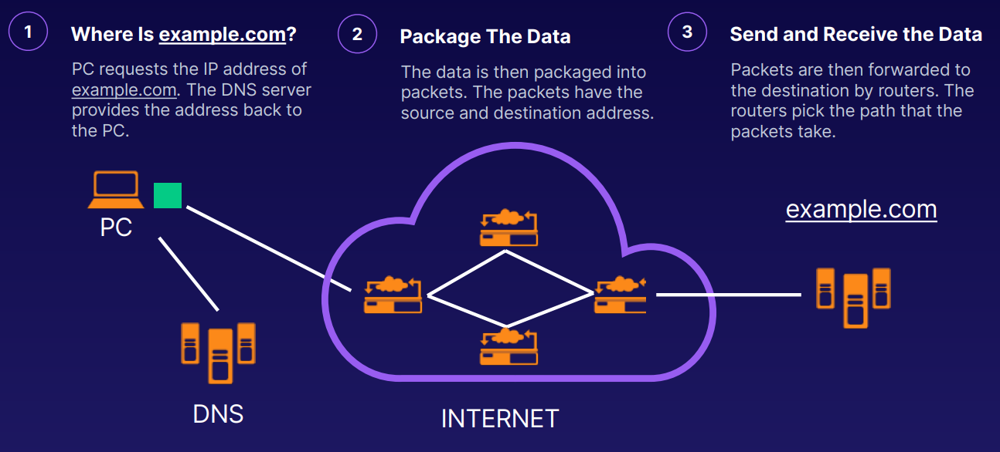

[Back to Linux Main](../main.md)

# Routing

### Concept) Routing
- Def.)
  - Routing is moving data from one network to another
- Props.)
  - Routers forward data between networks and decide which path (route) to use.
- e.g.) Visiting example.com
  

 

### Concept) How Do Routers Know the Path?
  - Routing Tables
    - Routers store information about other networks in routing tables.
    - They get this information from other routers.
  - Routing Protocols
    - Routers have their own rules for communication. These rules are known as routing protocols. 
    - This is how they share information about other networks and make decisions on the best path (route) to send the data packets. 
    - Each router along the path makes its own decision on which path the packet takes next. 
    - The shortest path isn’t always the fastest
  - Static Routes
    - Static routes always use the same path to send data between networks.
  - Dynamic Routes
    - Dynamic routes change the path the data packets get sent through, based on various factors like network congestion, router outages, and network speeds.

 

 

[Back to Linux Main](../main.md)