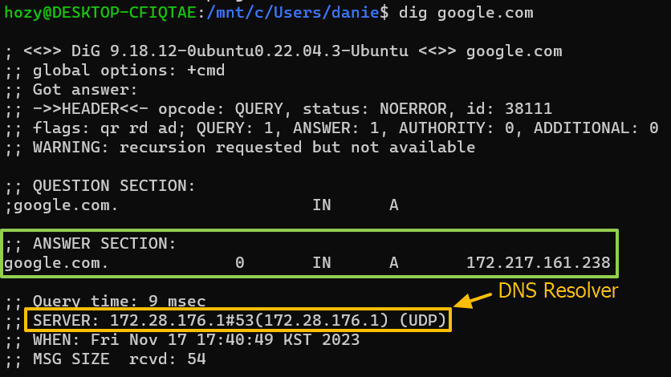
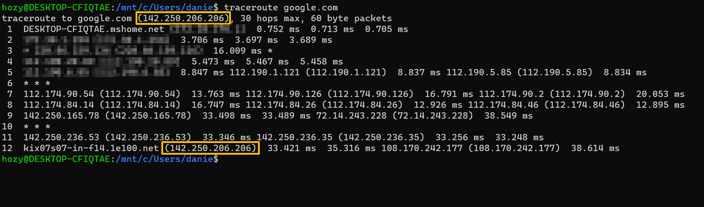
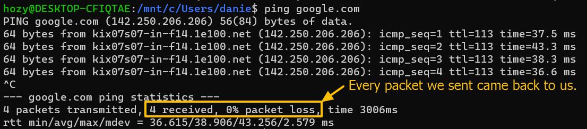

[Back to Linux Main](../main.md)

# Finding Connecting with Others

### Tech) Overview commands
#### 1. Remote IP Address
- Modern Linux
  ```
  dig [ip_addr_or_dns]
  ```
  - e.g.) Google.com
    
- Legacy Linux
  ```
  host
  ```
  ```
  nslookup
  ```
  - For Windows

<br>

#### 2. Routing
Routing to reach other computers
```
traceroute [ip_addr_or_dns]
```
- e.g.) google.com
  
  - The routing path from this PC to google.com

<br>

#### 3. Ping : How to check if a remote system is online
```
ping [ip_addr_or_dns]
```
- e.g.) google.com
  

<br>


<br>

[Back to Linux Main](../main.md)